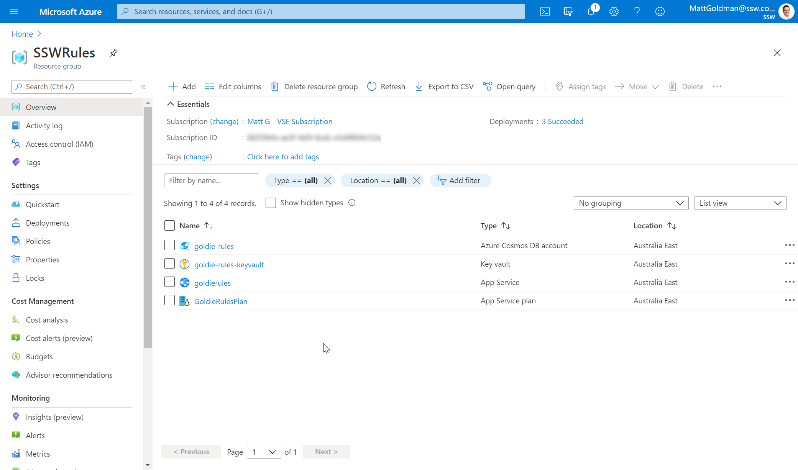
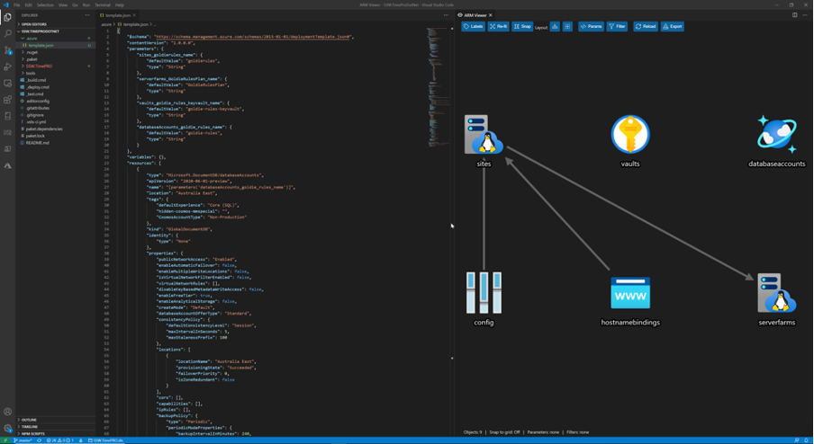
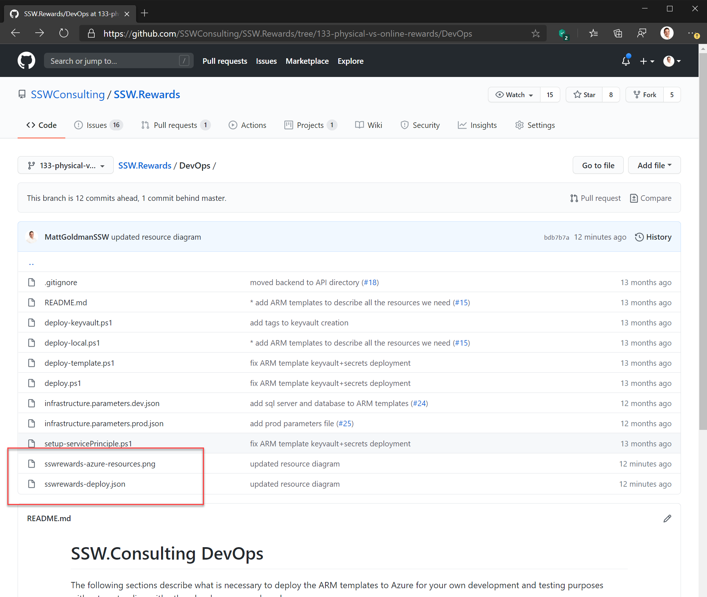
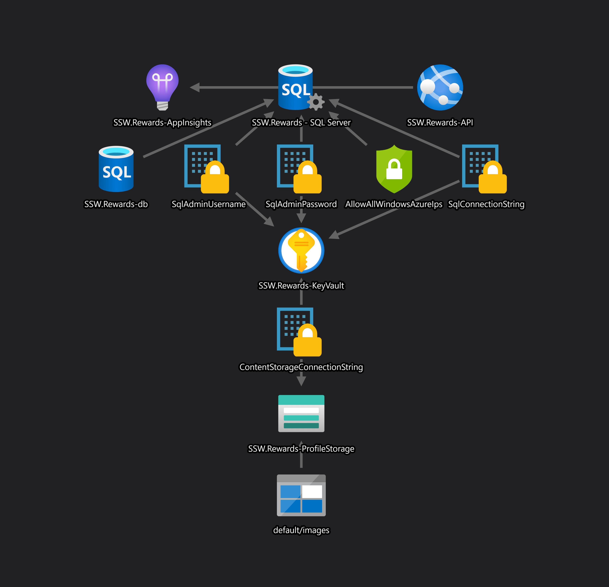

Looking at a long list of Azure resources is not the best way to be introduced to a new project. It is much better to visualize your resources.

You need an [architecture diagram](/architecture-diagram), but this is often high level, just outlining the most critical components from the 50,000ft view, often abstracted into logical functions or groups. So, once you have your architecture diagram, the next step is to create your Azure resources diagram.

<!--endintro-->

`youtube: https://www.youtube.com/embed/mSg4CM8FbXo`

### Option A: Just viewing a list of resources in the Azure portal

**Note:** When there are a lot of resources this doesn't work.

::: bad  
  
:::

### Option B: Visually viewing the resources

::: good  
  
:::

::: good

:::

::: good

:::

[Install ARM Template Viewer from VisualStudio Marketplace](https://marketplace.visualstudio.com/items?itemName=bencoleman.armview).

::: greybox
**Note:** Microsoft has a [download link for all the Azure icons as SVGs](https://docs.microsoft.com/en-us/azure/architecture/icons/).
:::

::: greybox
**Suggestion to Microsoft:** Add an auto-generated diagram in the Azure portal. Have an option in the combo box (in addition to List View) for Diagram View.

**Update:** This is now happening.
:::

`oembed: https://twitter.com/BenCodeGeek/status/1248272453509484550?ref_src=twsrc%5Etfw`

::: info
**Scrum Warning:** Like the architecture diagram, this is technical debt as it needs to be kept up to date each Sprint. However, unlike the architecture diagram, this one is much easier to maintain as it can be refreshed with a click. You could reduce this technical debt by automatically saving the .png to the same folder as your architecture diagram. It is easy to do this by using Azure Event Grid and Azure Functions to generate these for you when you make changes to your resources.
:::
