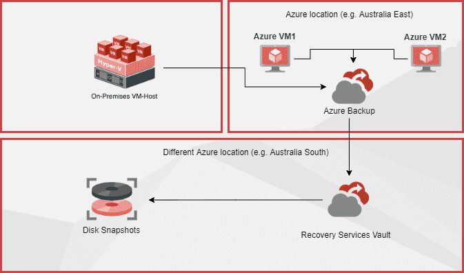

Azure Site Recovery is the best way to ensure business continuity by keeping business apps and workloads running during outages. It is one of the fastest ways to get redundancy for your VMs on a secondary location. For on-premises local backup see [Do you know why to use Data Protection Manager?](/why-use-data-protection-manager)

<!--endintro-->

Ensuring business continuity is priority for the System Administrator team, and is part of any good disaster recovery plan. Azure Site Recovery allows an organization to replicate and sync Virtual Machines from on-premises (or even different Azure regions) to Azure. This replication can be set to whatever frequency the organization deems to be required, from Daily/Weekly through to constant replication.

When there is an issue, restoration can be in minutes - you just switch over to the VMs in Azure! They will keep the business running while the crisis is dealt with. The server will be in the same state as the last backup. Or if the issue is software you can restore an earlier version of the virtual machine within a few minutes as well.

