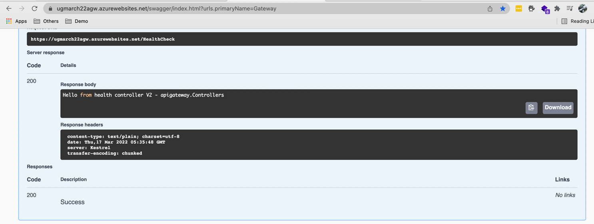
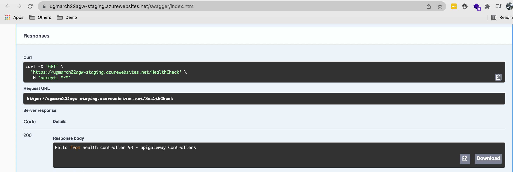
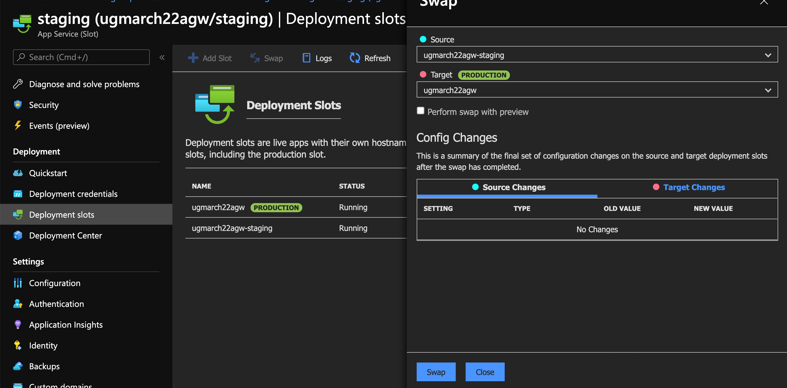
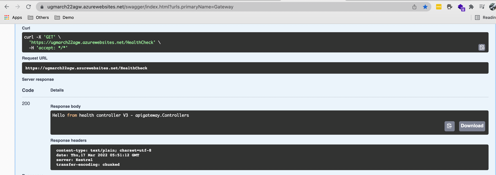
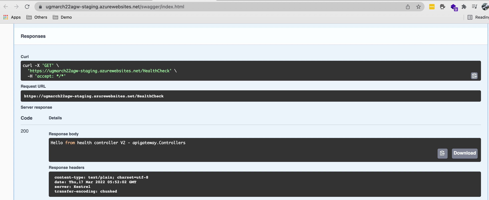

Azure App Services are powerful and easy to use. Lots of developers choose it as the default hosting option for their Web Apps and Web APIs. However, to set up a staging environment and manage the deployment for the staging environment can be tricky. 

<!--endintro-->

We can choose to create a second resource group or subscription to host our staging resources. As a great alternative, we can use a fully-fledged feature on App Service called deployment slot. 

### How to use deployment slots

To start using slot deployment, we can spin up another web app – it sits next to your original web app with a different url. Your production url could be **production\.website\.com** and the corresponding staging slot is **staging\.website\.com**. Your users would access your production web app while you can deploy a new version of the web app to your staging slot. That way, the updated web app can be tested before it goes live. You can easily swap the staging and production slot with only a turnkey configuration. See figure 1 to 5 below. 

### Other benefits of deployment slots

The benefit of using deployment slot is that if anything goes wrong on your production web app, you can easily roll it back by swapping with the staging slot – your previous version of web app sits on the staging slot – ready to be swapped back anytime before a newer version is pushed to staging slot.

Deployment slot can also work hand in hand with your blue green deployment strategy – you can opt user to the beta feature on the staging slot gradually. 

