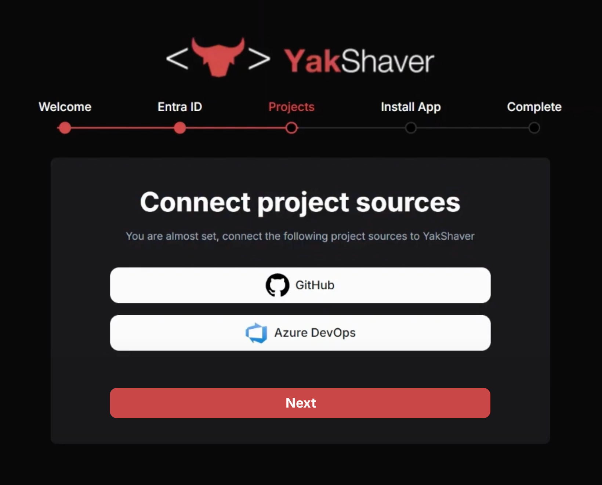
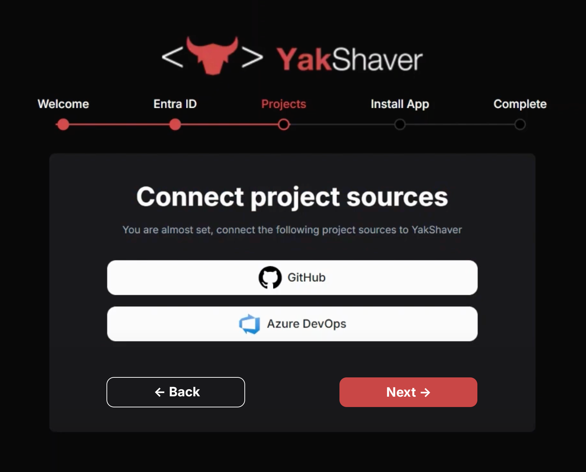

When building multi-step wizards (e.g. forms, onboarding flows, or setup processes), always provide a Back button—unless there's a very good reason not to.

A "Back" button gives users confidence that they can safely navigate through the steps without fear of losing progress. It helps reduce frustration and increases completion rates, especially when users need to review or correct something in earlier steps.

<!--endintro-->

::: good img-medium

:::

::: bad img-medium

:::

## Implementation tips

* Place the "Back" button **to the left** of the "Next" or "Submit" button
* [Use consistent labels](/label-buttons-consistently/) (don't use “Previous" or other variations).
   ::: info
   According to [Design Specifications and Guidelines - User Assistance](https://learn.microsoft.com/en-us/previous-versions/ms997609%28v=msdn.10%29#window-design), the commands for navigating through a wizard should be **"&lt; Back"** and **"Next &gt;"**.
   :::
* [Use icons to enforce the action meaning](/enforce-the-text-meaning-with-icons-and-emojis)
  
::: info
**Note:** Disabling or hiding the Back button is OK when:

* The previous step doesn’t exist (e.g. it's the first step)
* It's a single-step flow with no navigation needed
:::
