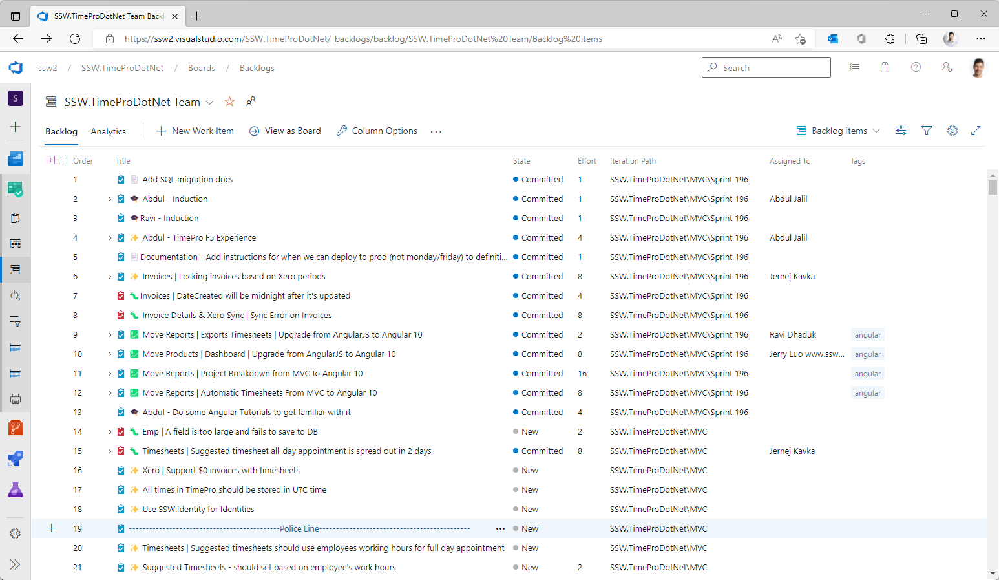

A Minimum Viable Product (MVP) is the core of your application that you should be aiming to build before you spend time on nice-to-haves, bells-and-whistles, and stretch-goals.

<!--endintro-->

To help focus your Product Owner and team on the core Product Backlog Items (PBIs) needed to fulfil the MVP, it can help to add a Police Line to your backlog.

1. Create a PBI and call it either:
   1. -----------------------------------MVP----------------------------------    
   2. -------------------------------Police Line------------------------------  
   3. ---------------------------------Phase 1--------------------------------

Then when deciding if a feature is vital or not, simply drag it above or below this line.

::: good

:::