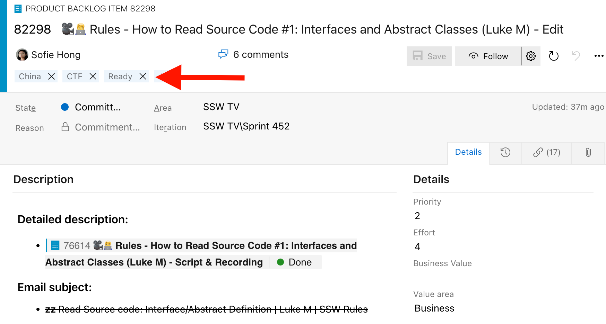
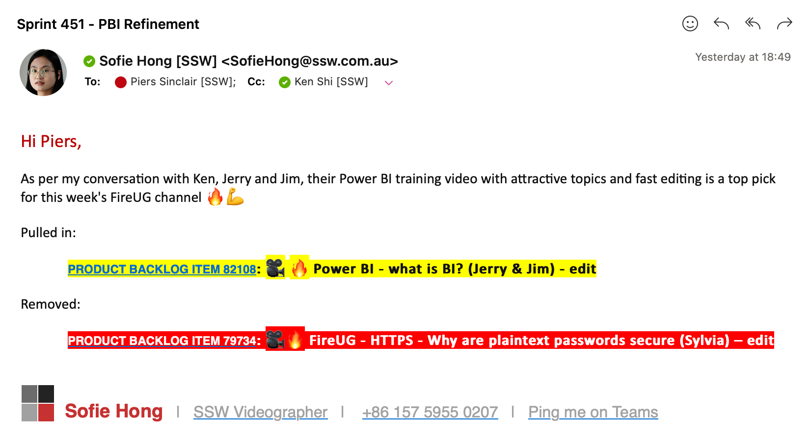

When a Scrum Team meets for Sprint Planning, they want to plan out the next week's work so they can get cracking on improving the product. However, the team often runs into a roadblock when they find that the Product Backlog Items (PBIs) are lacking in basic details. This problem leads to 1 of 2 outcomes:
- **Potential Outcome 1:** Poorly defined PBIs being added to the Sprint causing problems with shaky estimates and later down the track when developers are unclear about the PBI details and how to implement them.
- **Potential Outcome 2:** A lengthy Sprint Planning meeting with only a few people engaged while refining the PBIs.

Ideally, you want to avoid both of these outcomes by having well [defined PBIs](/defining-pbis) written in advance so the Sprint Planning session is simply a [tick and flick](/tick-and-flick).
 
<!--endintro-->

## The Solution - Product Backlog refinement meetings

The [Scrum Guide](https://scrumguides.org/scrum-guide.html) mentions the process of refining the Product Backlog as the core way to avoid these issues. However it is not prescriptive about how to perform this process. A Product Backlog Refinement meeting is a great way to ensure the Product Backlog is regularly refined. In this meeting, the Tech Lead and another developer refine all the PBIs. This process involves refining the PBIs in the backlog and adding a "Ready" tag or status when the PBI has met the [Definition of Ready](/have-a-definition-of-ready).

To ensure the Product Backlog Refinement meeting runs. Setup a recurring meeting with the following agenda:

::: email-template
|          |     |
| -------- | --- |
| To:      | {{ TECH LEAD }}, {{ CHOSEN DEVELOPER }} |
| Cc:      | {{ REST OF THE SCRUM TEAM }} |
| Recurrence:      | {{ ONCE PER SPRINT }} |
| Subject: | Product Backlog Refinement –  {{ PROJECT NAME }} |
::: email-content 

This meeting is to perform Product Backlog Refinement.

Product Backlog: {{ LINK TO PRODUCT BACKLOG }}

Agenda
1. Skip all PBIs that are already marked as "Ready"
2. Refine the top 5 PBIs that are not marked as "Ready"
    - Call in the Product Owner if any feature requires requirements clarification
3. Check if any PBIs need to be added
    - Consider any [Tech Debt](/technical-debt) identified in the [architecture review](/do-you-conduct-an-architecture-review-after-every-sprint)
    - Consider if [PBIs need to be broken down](/create-pbis-under-2-days)
    - Consider if a [Spike](/encourage-spikes-when-a-story-is-inestimable) is required
5. Check if any PBIs need to be deleted
    - Call in the Product Owner to double check

:::
:::

## What if there is an [unexpected PBI](/unexpected-requests/) that needs to be added into the Sprint?
 
Sometimes, we may encounter urgent new requirements and priority changes that need to be pulled into the Sprint immediately.
 
In that case, you may not have time to wait for the PBI refinement meeting, and the PBI may not be marked as "Ready" yet.
 
### The Solution
1. Create a new PBI (or update an existing one) with all the required information
2. Call the Tech lead to check the PBI
3. Mark the PBI as “Ready” and pull it into the Sprint
4. Send an email to notify the Product Owner and cc the Tech Lead

## Benefits of Product Backlog Refinement

✅ **Efficient Sprint Planning** - With most PBIs already refined, the Sprint Planning meeting becomes more efficient

✅ **Less time wastage** - Only the Tech Lead and another developer are required for most of refinement, so other people's time can be utilised elsewhere instead of wasted waiting around

✅ **Risk mitigation** - If the Product Owner or important stakeholders have to go on leave there is some extra buffer in the Product Backlog

✅ **Engaged Developers** - Developers are more likely to stay engaged when meetings are shorter and more focused

✅ **Well-Defined PBIs** - PBIs are well-defined before being added to the Sprint
