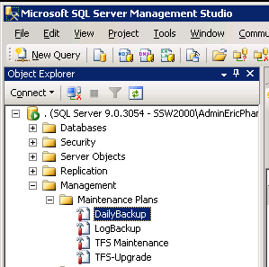

Run your daily backups to provide a safety net should things go wrong.

<!--endintro-->

::: greybox
1. Confirm that the TFS2008 databases were backed up last night. 
a. TfsActivityLogging
b. TfsBuild
c. TfsIntegration
d. TfsVersionControl
e. TfsWarehouse 
f. TfsWorkItemTracking
g. TfsWorkItemTrackingAttachments
:::
**Figure: If you can’t see the physical .bak file for all these, chase up your DBA**

2. Create a backup of the TFS2008 databases by running your Daily Backup maintenance plan on TFS2008 

