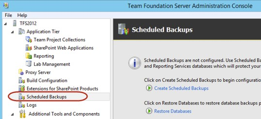
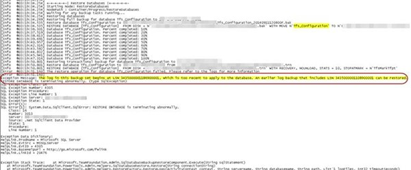
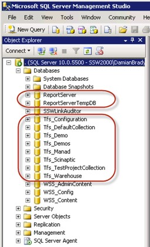
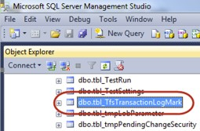
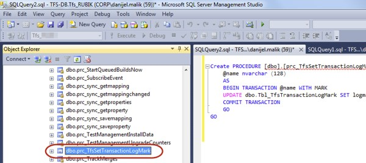
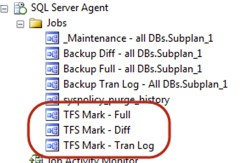
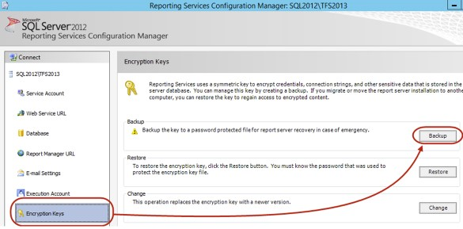

Before starting your upgrade, you should back up all your TFS databases.

It's important that you backup TFS by using one of the supported methods, to ensure that you can reliably restore your data if needed.

<!--endintro-->

:::greybox
**Tip:** The Team Foundation Server Team Foundation Server 2012 Update 2 and above has a built in Scheduled Backup tool which helps you to easily backup all TFS Databases. For versions prior to TFS 2012 Update 2 you have to use Backups tool from the [TFS Power Tools](https://marketplace.visualstudio.com/items?itemName=TFSPowerToolsTeam.MicrosoftVisualStudioTeamFoundationServer2012Power) package.
:::

In some cases you won't be able to use this tool e.g. with TFS 2012 Power Tools RTM. This version has a bug which causes a failure of Tfs\_Configuration DB when you try to restore it.

In such case you will have to manually backup databases. Make sure all relevant databases have been backed up. This includes all those starting with "Tfs\_"

::: info
**Important:** Manual backup requires additional user steps which involve creation of additional tables and stored procedures. These tables has to be created to keep TFS databases in sync.

Follow this instructions to properly backup your databases: [Manually back up Team Foundation Server](https://docs.microsoft.com/en-us/azure/devops/server/admin/backup/manually-backup-tfs?view=azure-devops-2020&viewFallbackFrom=azure-devops).
:::

If you manually backup the TFS Databases make sure you add additional jobs that execute 1 minute before the backup kick off.

Make sure you back up the Reporting Services database if you'd like your reports to come across as well.

For Reporting Services make sure you have backed up the encryption key.

