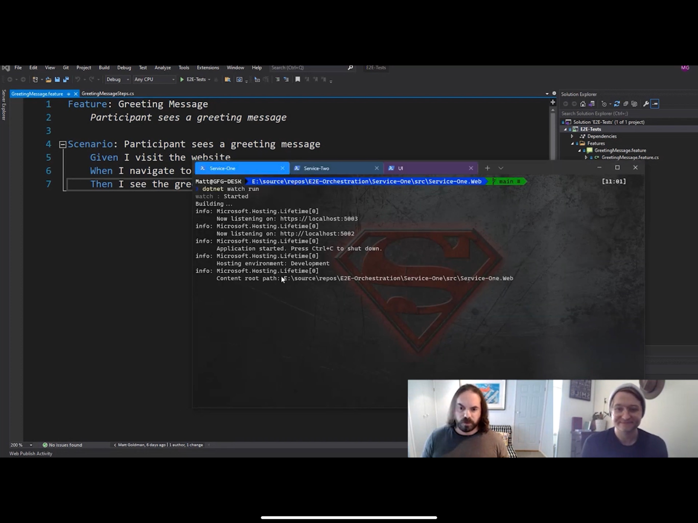

In the old days, reading and understanding test cases was something only developers could do. Behavioral-Driven Design (BDD) solves this problem by enabling organizations to define their use cases in plain language and integrate these aspects with testing frameworks.

<!--endintro-->

Using gherkin syntax you can write test scenarios in plain text using a few key words (Given, When, Then). Plain text makes the test scenarios easy to understand and visualise from a user perspective, even for non-technical team members.

