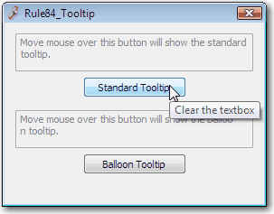
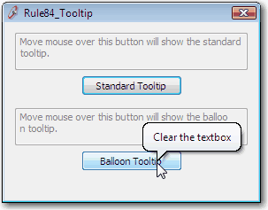

The standard tooltip is a rectangle, so the tool tip for the control can be misleading. While, the balloon tooltip has an arrow pointing to the destination control, which is clearer for users.

 <excerpt class='endintro'></excerpt> 
​<dl class="badImage"><dt></dt>
<dd>Figure: Standard tooltip.</dd></dl>
<dl class="goodImage"><dt></dt>
<dd>Figure: Balloon tooltip.</dd></dl>

To implement you can:

<ol><li>Set the standard Tooltip's property IsBalloon true or</li>
<li>Use EdwardForgacs' balloon tooltip control.</li></ol>

