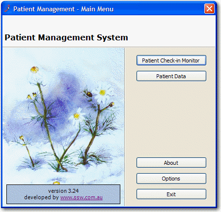

A mnemonic for a button is the letter which has an underscore, and the user can press the button using Alt-<char>.</char>

<!--endintro-->
<dl class="badImage">&lt;dt&gt;
      
   &lt;/dt&gt;<dd>Figure: Bad Example - All buttons without Mnemonic</dd></dl><dl class="goodImage">&lt;dt&gt;
      
   &lt;/dt&gt;<dd>Figure: Good Example - All buttons with Mnemonic - user can easily choose which button they want without a click</dd></dl>
In Windows Applications, it is quite easy to assign a mnemonic to a button with the "&" character.

So for the case above, the text would be:
<dl class="code">&lt;dt&gt;
btnAbout.Text = "&About"

   &lt;/dt&gt;</dl>
 **Tip:** In Windows XP the mnemonic display effects can be hidden by Default and then shown every time the user presses the Alt key.
