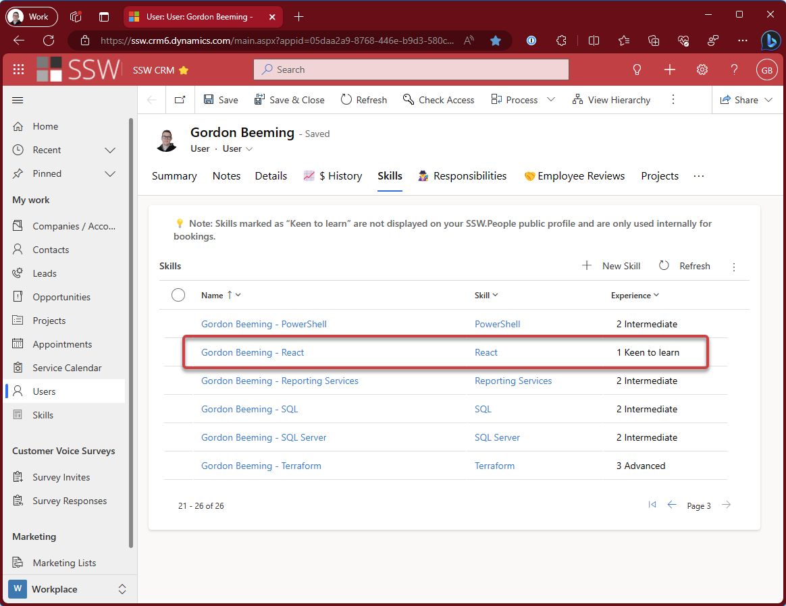

In any organization that juggles multiple projects, having clear coordination and allocation of resources is essential. The role of a "Bench Master" is critical in ensuring a smooth transition for developers between client projects, minimizing downtime, and promoting ongoing learning and development.

<!--endintro-->

## What does a Bench Master do?

A bench master's primary responsibility is to ensure that all developers know what they are working on when they are not on client projects. In order to accomplish this, the bench master has these secondary responsibilities:

- Responsible for allocating a Scrum team to new employees
- Responsible for maintaining a list of internal projects
- Across all internal projects at a high level
- Knowing the priority of internal projects
- Knowing what skills are required for each project
- Professional development - Allocating people projects based on what they want to learn
- Bench Backup - Keep someone in the loop for when Bench Master is unavailable
- Weekly meeting with important stakeholders to talk about priorities

Some other terms that are commonly used for this type of role are:

- Bench Coordinator
- Resource Coordinator
- Operations Manager
- Allocation Manager
- Capacity Manager
- Scheduling Manager

## How do developers know what to work on?

Developers don't like uncertainty, it's important for them to know what projects they'll be working on in-between client projects. Knowing in advance what projects they'll be working on minimizes the time it takes to get up to speed on a project as they could be looped into communications for the project before they start so they have some recent context when they join.

As you can imagine there is a lot of information that would be required for a bench master to be effective. The following is a list of information that would be useful for a bench master to have.

- **Developers and their skills** - Your CRM likely has this information already, see https://www.ssw.com.au/rules/search-employee-skills/

- **Developer client bookings** - You can get this information from your staffing report, see https://www.ssw.com.au/rules/know-where-your-staff-are/

- **Internal projects** - It's important to know their priorities as well as tech stacks, if it's a big project, knowing the actively developed portions tech stack would be helpful

This covers the basics of what a bench master would need to know, there is other factors that would influence the bench master's decisions such as developer personal goals. For example, if a developer wants to learn react, the bench master could try place the developer on a project that uses react.

## What happens when the Bench Master is not available?

Here's some inputs the Bench Master would consider for each developer:

- Client needs - Is there any client work that tentatively needs the developer?
- Internal Projects - What is most important? 
- Internal Projects - What teams are looking for a Dev?
- Current skillset
- Time between now and next client?
- Inbox count? see https://www.ssw.com.au/rules/dones-is-your-inbox-a-task-list-only/
- Check Long Term goal tracker e.g. Trello board, anything important? Anything doable in the time between now and next client?
- Personal Development Time 
  - e.g. Are there any languages you want to learn? "I want to learn Blazor please" (Bench Master puts person on Blazor project)

## What happens when the Bench Master is not available?

It's important to have a backup bench master in case the bench master is not available. 

- The backup bench master should be someone who is familiar with the internal projects and the skills of the developers. 
- A semi-regular catchup between the bench master and the backup bench master would be a good idea to ensure that the backup bench master is up to date with the current state of the bench.
- Office specific morning meeting for anyone not on client work, for people not already assigned to an internal project or have finished work on an internal project

::: info
**Tip:** If you have multiple offices, consider having a local backup bench master in every office location
:::

