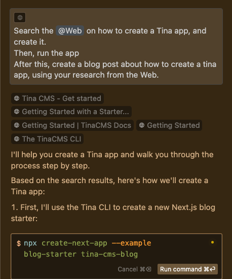

Since the release of GitHub Copilot in 2021, we have witnessed a dramatic evolution in how developers work within their IDE. It started with a simple AI autocomplete, and has since progressed to a chat function. Now AI has been integrated deeply into IDEs with products like Cursor and Windsurf, now embedding an even deeper level of AI Integration within a developer's workflow. 

`youtube: https://www.youtube.com/watch?v=a6h3hsYOn3o`  
**Video: Let Cursor do the coding for you | Calum Simpson | SSW Rules**

## Powerful features that AI-Powered IDEs provide:

## Code Completion

GitHub Copilot first popularized the 'code completion' feature for AI-powered IDEs. Code completion will try to guess what you are going to write, and suggest how to complete this line – saving time and effort by simply pressing 'tab'

## Command Generation

In Cursor and Windsurf, you can hit ctrl-K (or command-K), to convert natural language to a bash command. This is very useful for when you have forgotten the exact syntax of a bash command.

**Figure: Cursor Command Generation (ctrl-K)**

## Chat

Chat functionality within an AI-powered IDE adds an intelligent assistant that can offer answers and suggestions without needing to leave the IDE. Unlike generic AI tools, it allows you to add context to your question, such as a file or even codebase, which lets the AI provide more tailored solutions.

### Context

Within the chat for Cursor, you can specify the level of context you would like to include with your prompt. By typing the `@` character, the following menu will appear.

**Figure: Cursor Chat Context, opened by typing `@`**

In Cursor, the `@Web` function is very useful for any situations where recent information, or information that the model has not been trained on is needed! You can also use `@Git` to compare diffs with the main branch, to generate a nice PR summary.

## Agent

The Agent function in AI-powered IDEs represents a significant leap in a developer's workflow. It acts as a semi-autonomous coding assistant, capable of directly controlling the IDE (creating/editing files, reading the codebase, searching the web, executing bash commands).

::: bad 
Bad Example: Using ChatGPT with only one instruction, requiring you to copy paste the commands into the IDE.
:::

::: good
Good Example: Using Cursor Agent to create a Tina App, with multiple provided instructions.
:::

## Comparison Table

| Feature               | [Cursor](https://www.cursor.com/) | [IDE + GitHub Copilot](https://github.com/features/copilot) | [Windsurf](https://codeium.com/windsurf) | [GitHub Copilot Workspace](https://githubnext.com/projects/copilot-workspace) |
| --------------------- | ------------------------------------------------------------ | ------------------------------------------------------------ | ------------------------------------------------------------ | ---------------------------------------------- |
| Free Version          | • 2000 completions per month • 50 slow premium requests per month | • 2000 completions per month • 50 chat messages per month | • 5 premium user prompts • 5 premium Flow Actions | ❌ |
| Price (USD per month) | $20 | $10 | $15 | $10 (Bundled with Copilot Pro) |
| AI Model(s)           | • cursor-small (free) • Anthropic Claude (Sonnet, Haiku) • OpenAI (GPT 3.5, 4, 4o) | • Anthropic Claude (Sonnet, Haiku) • OpenAI (GPT 3.5, 4, 4o) | • Meta Llama • Anthropic Claude (Sonnet, Haiku) • OpenAI (GPT 3.5, 4, 4o) | OpenAI (GPT 3.5, 4, 4o) |
| Custom Models         | ❌ | ❌ | ❌ | Enterprise Version |
| Custom Rules          | ✅ | ✅ | ✅ | ❌ |
| Auto-Completion       | ✅ | ✅ | ✅ | ✅ |
| Chat                  | ✅ | ✅ | ✅ | ✅ |
| Agent                 | ✅ | ❌ | ✅ | ✅ |
| Privacy Mode          | ✅ | ✅ | ✅ | ✅ |
| GitHub Integration    | ❌ | • Copilot Chat • Auto-generate commit message | ❌ | • Full Workflow is on GitHub • Generate PR Summary |
| Web Searching         | ✅ | ❌ | ✅ | ❌ |
| Supported IDE         | Cursor IDE - Forked VS Code (with VSCode Extensions Supported) | • Azure Data Studio • JetBrains IDEs • VS Code • Visual Studio • Neovim • Xcode | Windsurf IDE - Forked VS Code (with VSCode Extensions Supported) | • Browser based • VSCode Support (GitHub CodeSpace) |

## A word of caution

Artificial Intelligence is still very much a work in progress. It makes mistakes, especially when working with lesser-known programming languages and frameworks, and will often hallucinate. It is the developer's responsibility to ensure that the code they publish is optimized, and AI tools should only be used for assistance, and not as a direct replacement for a developer. 

You wouldn't send an email written by ChatGPT without first checking it for correctness and intention. Similarly, you should not commit any code written by AI without first reading through it, and testing it.

You are solely responsible for the code you commit!

## Which is best?

Reminder: Investing in one of these tools may prove to be worthwhile, and you can always claim it as a tax deduction.

As you can see from the comparison table, each of the AI-powered IDEs rival each other in most categories, and you can't go wrong with any of them. 

Give each of them a try – they all have free trials, so you can see which one works best for you. 

Leave a comment and let us know which is your favorite AI-powered IDE, and why!
