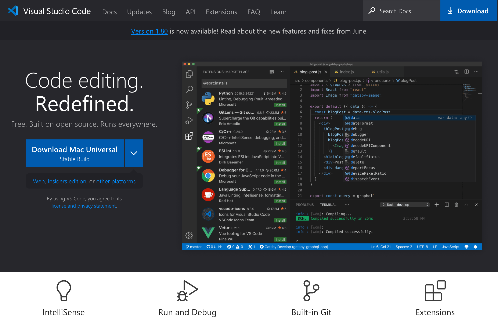
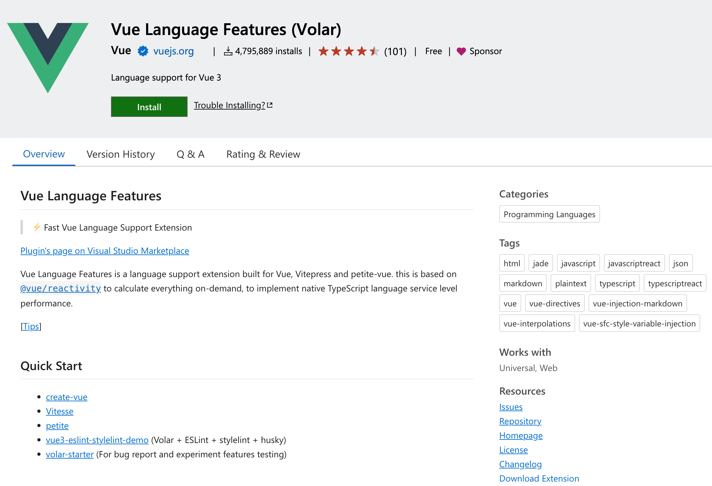
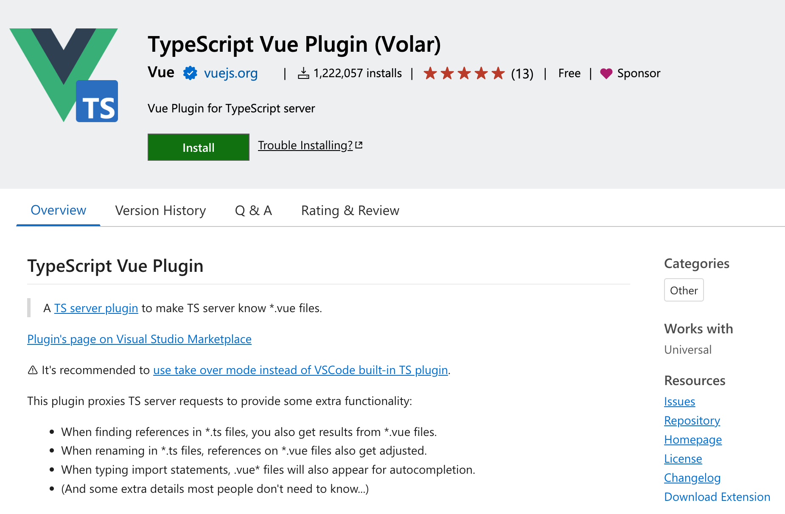

There are many options available for code editors for working with Vue.js. The recommended editor is **[Visual Studio Code](https://visualstudio.microsoft.com/downloads/)**.

<!--endintro-->

::: good

:::

Visual Studio Code is a powerful and wildly popular editor that's perfect for developing your Vue.js project. Out of the box, Visual Studio Code has excellent editing support for JavaScript and TypeScript, but for full support of Vue.js we'll need to make use of its rich extensibility.

The recommended extension for working with Vue.js in Visual Studio Code is the official **Vue Language Features** extension.

**[Vue Language Features (Volar)](https://marketplace.visualstudio.com/items?itemName=Vue.volar)** provides full language support for Vue.js in Visual Studio Code. This provides useful features like syntax highlighting, TypeScript support, and IntelliSense support for code completion.

::: good

:::

If you're using TypeScript for your project, it's also recommended to install **[TypeScript Vue Plugin (Volar)](https://marketplace.visualstudio.com/items?itemName=Vue.vscode-typescript-vue-plugin)** to add type support for .vue files and provide some additional helpful features when working with TypeScript in your Vue.js project.

