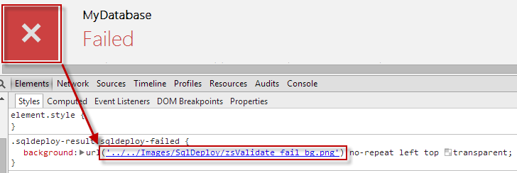
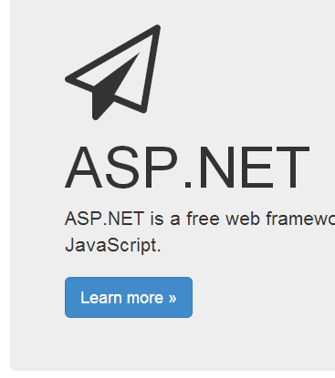

When building a web application, it is common that you will need icons in the UI. Traditionally, this has been done with images (e.g. png, jpg) which leads to a lot of resource management.

<!--endintro-->

::: bad  
  
:::

This is simplified if you are using **Bootstrap**, as it comes with a font-based icon library you can use in your web application. However, there is an even better third-party font-based icon library you should use when using Bootstrap: [Font Awesome](https://fontawesome.com/).

Font Awesome provides scalable vector icons that can be customized purely through CSS and some are completely free for commercial projects. This is great if you’re tight on implementation deadlines and need generic icons in a hurry. In the ideal world, a specifically custom-designed icon set is the way to go.

Using it on your project is easy, just use your email and register on their website: [Get Started](https://fontawesome.com/start). Then you will be able to download and serve locally or use a CDN.

Read the ["Basic Use" documentation](https://fontawesome.com/how-to-use/on-the-web/referencing-icons/basic-use).

If you are using **Azure**, there is an awesome icon collection with several options for you to use: http://code.benco.io/icon-collection/

::: good  
  
:::

Also check out [Eric Phan's blog for more info](http://ericphan.net/blog/2013/10/15/javascript-corner-font-awesome).
