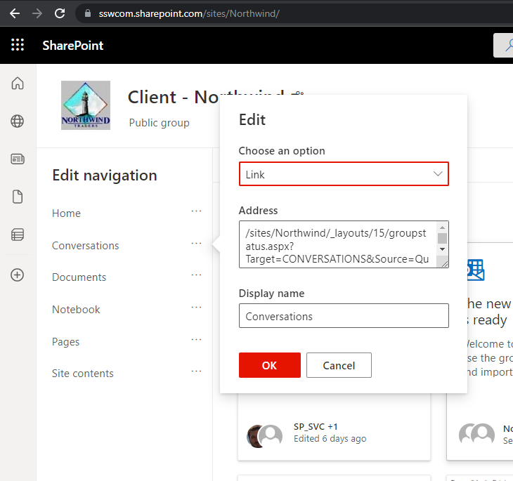

On intranets you always want a bunch of links easily accessible and customizable by the end users.

<!--endintro-->

In SharePoint your left navigation can be:

### The built-in site navigation

Good points: 

* Built-in – the default navigation system in SharePoint

Bad points:

* Viewer – Not very pretty
* Viewer – Can only use emoji not icons in names
* Customizing – Cant be customized
           
::: bad

:::

::: bad

:::

### Web links – SharePoint web part

Good points:

* Pretty
* Easy to edit
  Bad points:
* Static (only exists on the page, won’t show on any other pages on the site)

Good example:

::: todo
TODO: Insert Warwick’s video when made
:::
::: good
Figure: Good example – Customizing is easy
:::

::: good

:::
