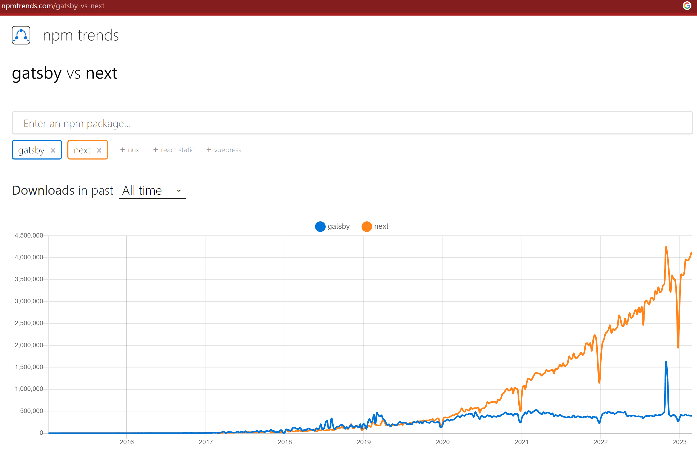

Pure HTML pages are the fastest website around.  However, server-side scripting languages enable richer functionality. Static sites solve this problem by providing the best of both worlds. Static sites are

* Cheap
* Easy to use
* Fast

On the other hand, complex functionality can be a bit more limited and time consuming to implement.

Here are some popular static site generators:

| **Name**                     | [NextJS](https://nextjs.org/) (Recommended) | [Gatsby](https://www.gatsbyjs.com/)            | [Astro](https://astro.build/)                                                         | [Scully](https://scully.io/)      | [Gridsome](https://gridsome.org/)    | [Jekyll](https://jekyllrb.com/)                                                                              |
| ---------------------------- | ------------------------------------------- | ---------------------------------------------- | ------------------------------------------------------------------------------------- | --------------------------------- | ------------------------------------ | ------------------------------------------------------------------------------------------------------------ |
| **Language**                 | [React](https://reactjs.org/)               | React                                          | Most major JS frameworks via [islands](https://docs.astro.build/en/concepts/islands/) | [Angular](https://angular.io/)    | [Vue](https://vuejs.org/)            | [Liquid](https://www.shopify.com/partners/blog/115244038-an-overview-of-liquid-shopifys-templating-language) |
| **Data Handling**            | Fully customisable                          | [GraphQL](https://graphql.org/)                | Fully customisable                                                                    | Fully customisable                | GraphQL                              | Source code data files                                                                                       |
| **Data Sources**             | Fully customisable                          | Filesystems, CMS, APIs, Databases, Local files | Fully customisable                                                                    | Fully customisable                | Source Plugins, APIs, Local files    | Local files                                                                                                  |
| **GitHub Pages Integration** | Requires setup                              | Seamless deployment via config files           | [Deployment via GitHub Actions](https://docs.astro.build/en/guides/deploy/github/)    | Deployment via GitHub Actions     | Seamless deployment via config files | Works out of the box                                                                                         |
| **Decap CMS (formerly Netlify CMS) integration**  | ✅                     | ✅                                            | [✅](https://docs.astro.build/en/guides/cms/decap-cms/)                               | ✅                                | ✅                                  | ✅                                                                                                          |

 

Two examples of static sites in action are [SSW People](https://www.ssw.com.au/people/) and [SSW Rules](https://www.ssw.com.au/rules/).

There are a few hosting options to choose from including:

* [Azure static web apps](https://azure.microsoft.com/en-us/services/app-service/static/) (recommended for small websites)
* [Azure static storage](https://docs.microsoft.com/en-us/azure/storage/blobs/storage-blob-static-website) (recommended for large websites)
* [Cloudflare](https://pages.cloudflare.com/)
* [GitHub Pages](https://pages.github.com/)
* [Surge.sh](https://surge.sh/)