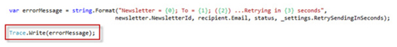
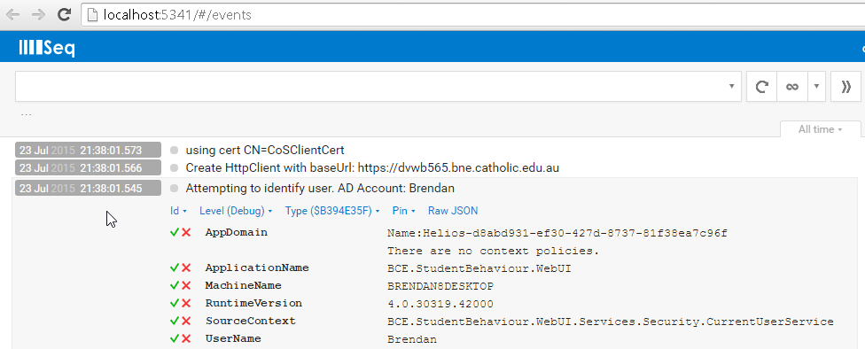

Did you know that writing your own logging infrastructure code wastes time? You should use a logging library, and the best logging library is Serilog.

Serilog is a NuGet package that can be included in any .NET application, is easy to configure, supports many different output targets, has great performance, and allows for runtime changes to the configuration. Serilog also supports full integration with log4net so is easy to use with any older codebase using log4net.

<!--endintro-->

Serilog supports all the log4net concepts of logging at different levels of importance (e.g. Error, Warning, Information) and having different logs for different components of your application (e.g. a Customer Log and an Order Log).

Serilog's main advantage over previous loggers is its ability to serialize and log full .net objects rather than just strings. Serilog also has a powerful, nested context system allowing log events to be grouped by request, operation etc.

Serilog has the concept of "sinks": pluggable modules that can consume, store and/or act on logging events. The most powerful sink is Seq - a web application that allows the user to perform complex search queries on incoming log data in real time.

Other sinks allow you to:

* save logs to a file
* export to log4net (and subsequently use any log4net appender)
* save to a database
* export to Application Insights, New Relic, and many other APM platforms

Many other sinks are available as described here: https://github.com/serilog/serilog/wiki/Provided-Sinks

::: bad  
  
:::

::: bad  
  
:::

::: good  
  
:::

::: good  
  
:::

Serilog should be added to your project via the NuGet package manager.

See also [Do you use the best middle tier .NET libraries?](/do-you-use-the-best-middle-tier-net-libraries)
