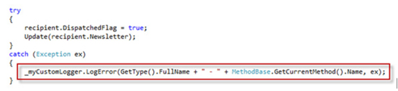
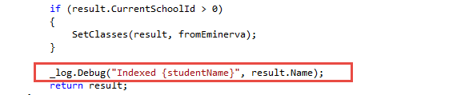

Did you know that writing your own logging infrastructure code wastes time? There are awesome logging abstractions in .NET Core and .NET 5+ that you should use instead!

These abstractions allow you to:
- create log entries in a predictable and familiar fashion - you use the same patterns for logging in a [Background Service](https://docs.microsoft.com/en-us/dotnet/core/extensions/logging?tabs=command-line) as you would in a [Blazor WASM app](https://docs.microsoft.com/en-us/aspnet/core/blazor/fundamentals/logging?view=aspnetcore-5.0&pivots=webassembly) (just some slightly different bootstrapping 😉)
- use Dependency Injection; your code doesn't take a dependency on a particular framework (as they are abstractions)
- filter output based off severity (Verbose/Debug/Info/Warning/Error) - so you can dial it up or down without changing code
- The logging sinks - where the logs are written to e.g. log file, database, table storage, or Application Insights
- Can be extended with packages such as [Serilog](https://serilog.net/)

<!--endintro-->

Serilog supports all the log4net concepts of logging at different levels of importance (e.g. Error, Warning, Information) and having different logs for different components of your application (e.g. a Customer Log and an Order Log).

Serilog's main advantage over previous loggers is its ability to serialize and log full .net objects rather than just strings. Serilog also has a powerful, nested context system allowing log events to be grouped by request, operation etc.

Serilog has the concept of "sinks": pluggable modules that can consume, store and/or act on logging events. The most powerful sink is Seq - a web application that allows the user to perform complex search queries on incoming log data in real time.

Other sinks allow you to:

* save logs to a file
* export to log4net (and subsequently use any log4net appender)
* save to a database
* export to Application Insights, New Relic, and many other APM platforms

Many other sinks are available as described here: https://docs.microsoft.com/en-us/aspnet/core/fundamentals/logging/?view=aspnetcore-6.0#built-in-logging-providers

::: bad  
  
:::

::: bad  
  
:::

::: good  
  
:::

::: good  
  
:::

Serilog should be added to your project via the NuGet package manager.

See also [Do you use the best middle tier .NET libraries?](/do-you-use-the-best-middle-tier-net-libraries)
