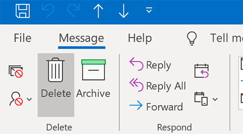
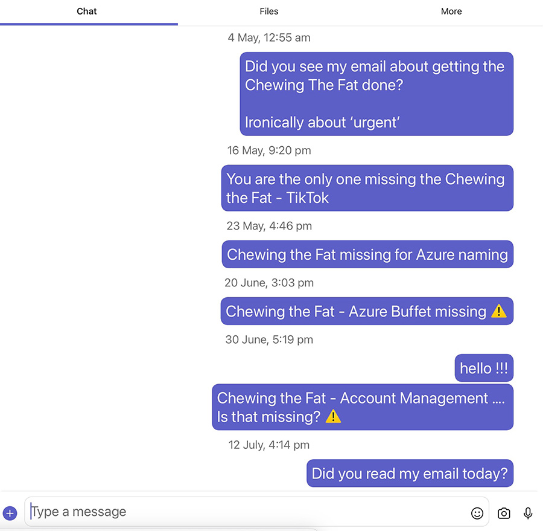

You should always try and reply to emails and IM messages within a timely period, but this is not always possible.

Sometimes people see a 6-month old task/question, and just delete/ignore thinking it's "too old"... or because "the customer will think we're a joke taking this long to do something!" No matter how long it takes to do some tasks, it's always better to get it done.

<!--endintro--> 

Of course, there are tasks that can be irrelevant with the passage of time. You should still reply and state that you don't believe it is needed anymore.

Always reply to emails and IM messages regardless of how long it takes to respond. It shows you value the sender's input and they'll know their ideas and suggestions are not ignored.

::: bad

:::

::: bad

:::

::: greybox
Hi Bob,

Sorry for the late reply

Done
:::
::: good
Figure: Good example - Getting an old task done
:::

::: greybox
Hi Bob,

This is an old one. I tried to call you but you were not available. This still looks relevant so I will start this old task today or tomorrow

1. Please let me know if you don't want that

:::
::: good
Figure: Good example - Asking if an old task is still wanted
:::

::: greybox
Hi Bob,

I assume this is too late now. Sorry I missed this one
:::
::: good
Figure: Good example - Informing a task is not relevant anymore
:::

::: greybox
Hi Bob,

Cleaning my inbox...
Checked and this task was already done a few months ago
:::
::: good
Figure: Good example - Informing a task was already done
:::
