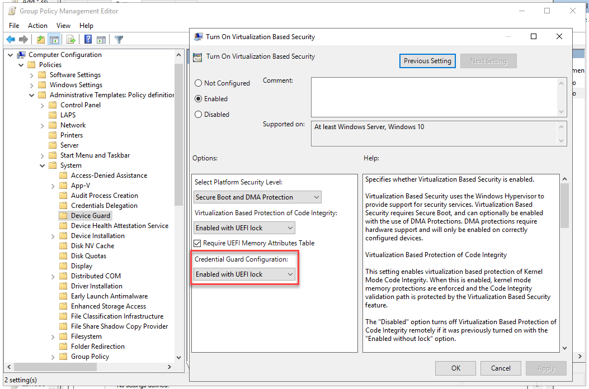
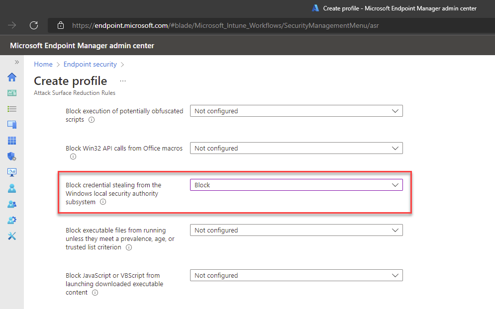

If an attacker gets into a computer on your network, they can dump hashed credentials of any user that has logged on to that computer from lsass.exe. This is easy to do if you know where to go - thankfully, it is also fairly easy to block!

You can read more about [credential dumping here](https://attack.mitre.org/techniques/T1003/001/).

<!--endintro-->

Credential Guard was introduced in Windows 10/Server 2016. It runs lsass.exe in an isolated virtualized environment without any device drivers, so that the memory cannot be dumped. Depending on your environment, there are a few ways you can implement Credential Guard.

### Group Policy

In a Domain environment, you can roll out Credential Guard with a GPO.

1. Go to **Computer Configuration** | **Administrative Templates** | **System** | **Device Guard |** **Turn On Virtualization Based Security**
2. Enable the policy, and set Credential Guard to **Enabled with UEFI lock** (recommended), or **Enabled without lock**.

**Note:** **Enabled with UEFI lock** means that Credential Guard needs to be disabled in the GPO **and** on the device to be turned off. **Enabled without lock** allows Credential Guard to be disabled just with the GPO.

### Microsoft Endpoint Manager / Intune

If you use Microsoft Endpoint Manager, you can roll out Credential Guard with an Attack Surface Reduction policy. 

1. Go to **Microsoft Endpoint Manager | Endpoint Security | [Attack surface reduction](https://endpoint.microsoft.com/#blade/Microsoft_Intune_Workflows/SecurityManagementMenu/asr)**
2. Create a new policy, or edit an existing one
3. Set **Block credential stealing from the Windows local security authority subsystem** to **Block**

### More information & other options

For more information or for instructions to implement Credential Guard on a single computer, see [Microsoft's documentation on Credential Guard](https://docs.microsoft.com/en-us/windows/security/identity-protection/credential-guard/credential-guard-manage).
