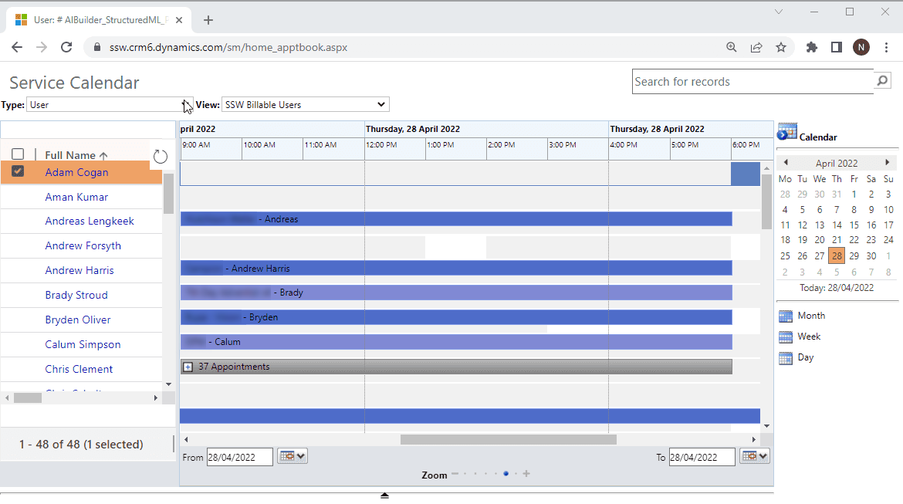
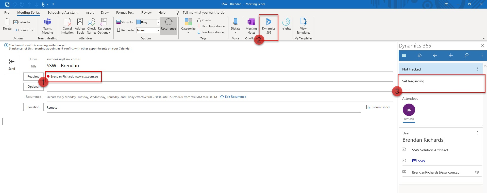
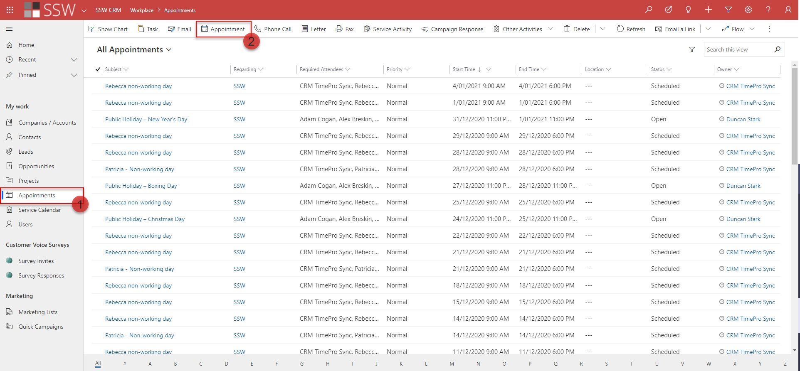
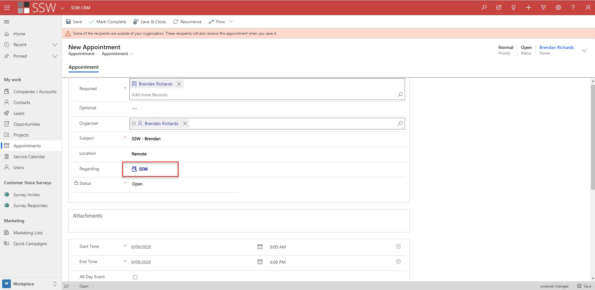
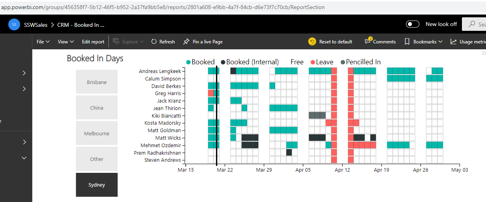
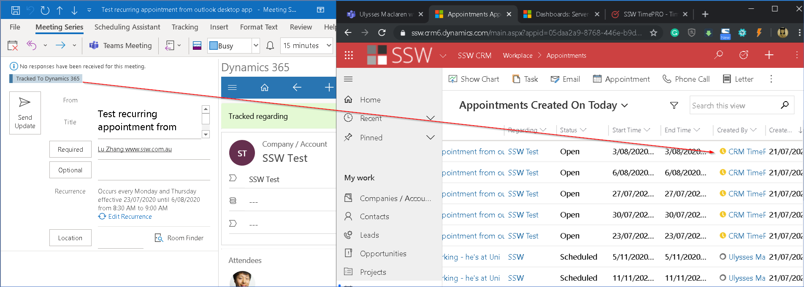

It is the responsibility of Account Managers to book developers for known client work, however anyone can book a developer, including the developer themselves. Also if a developer notices they should be booked, but there's nothing in their calendar, and they can't figure out the below, as a minimum they should ask the Account Manager to book them.

::: greybox  

**The Rule of the 3 T's**

Before booking developers, make sure you talk to them and check that they are cool with:

* The Time - how long is the project?
* The Tech - what skills are required?
* The Team - who will they be working with?

:::

To see which developers are available for booking:

::: ok

:::

::: good

:::

There are a few different ways of booking developers for project work, either via Outlook or the browser.

<!--endintro-->

### Option 1: Use the Outlook Calendar and "Set Regarding" (recommended)

Prerequisite: [Do you install the Dynamics 365 App?](/install-the-2-add-ins)

This is generally the easiest way for developers to book themselves in as they don't need to leave Outlook and 90% of the steps will already be familiar to them.

1. Create a new Outlook appointment (in the Desktop or Web client) and give it a relevant subject
2. Invite required resources if there are other people working with you or if you're booking for someone else

* **Note:** If you're booking for someone else, just have them in the To box of the appointment. If you're booking yourself AND someone else, have both of you in the To box

3. Invite the client as optional. If you do this, also make it a Teams Meeting and add your email signature
4. Set the time and location for your appointment
5. Set "Show As" to "Free" (so their Teams Status will not show them as "In a Meeting" all day
6. Set "Reminder" to "None" so you and they don't get spammed by unnecessary reminders
7. Set the recurrence if it’s more than 1 day of work
8. Click "Dynamics 365" on the ribbon which will open a side panel and click on "Set Regarding" then search for the company that you want to book the developers to work on (this is the step that syncs it with CRM)

### Option 2: CRM Activity Appointments

This is a backup option for anyone who doesn't have access to Outlook with the CRM add-in.

1. Create new appointment in Dynamics 365 Online

2. Set the Subject
3. Select the resources that you want to book
4. Select the client that you want to book the developers to work on
5. Set the location
6. Set the Start and End times
7. If the booking is for more than 1 day, click “Recurrence” and set the frequency

**Tip:** If you do not want the to block your calendar, you can change the organizer and owner to the developer you are booking. It will still track to the Service Calendar, but wont add it to your personal calendar, only the developers.

### Adding Tentative Bookings

Sometimes you may want to reserve a consultant for an appointment but are not able to confirm with the client immediately. In this case, create a Tentative Booking which reserves the consultant for the period of the booking without assigning them to the client account. The purpose of a Tentative Booking is to reserve a consultant and trigger a conversation between Account Managers if the consultant is required on confirmed client work over the same period.

To create a Tentative Booking:

1. Follow the same steps above to create the Appointment
2. Instead of choosing a client account for 'Set Regarding', choose the company (E.g. "ssw.pencilledin").

**Tip:** Create a "Booked In Days" Report and make the Tentative Bookings display obviously (e.g. A grey color), so Account Managers can easily see it if they need to use that time.

### Adding Internal Bookings

If a developer is needed for non-billable work (e.g. urgent internal work) or travelling to teach public training events, their time should be blocked out so it shows as unavailable for client work.

To book someone for internal work:

1. Follow the same steps as above to create the Appointment
2. Instead of choosing a client account for "Set Regarding", choose your own company (e.g. "SSW").
3. Mention which internal project the developer is working on in brackets (e.g. "SSW - Brady (Rules)")

### Using a separate Outlook calendar to book appointments

If you have a lot of staff, it can be useful to use a separate calendar to make your bookings - this stops them from covering your everyday calendar and making it hard to read.

Unfortunately, you cannot use a sub-folder to track appointments in Outlook. You need to create a whole new email account and then add it to your Outlook folder.

Using the example of SSW's **crmtimeprosync@** account, this account is used to add appointments to the Service Calendar, and these are then added through the SSWBookings calendar in Outlook:

Note: If using a separate Exchange calendar, it's highly recommended to login via Outlook Web Access (OWA) rather than loading it up as a shared calendar in your Outlook Desktop client. This is because it handles multiple users much better this way, and will avoid synching issues. 

### How to set it up

**For OWA** 
Open browser’s incognito mode | go to https://outlook.office.com | logon with the crmtimeprosync@ssw.com.au account

**For Outlook Desktop** 

Go to Files | Add an account | Restart Outlook once it completes 

Please note you will need to get the password from your friendly SysAdmins.
