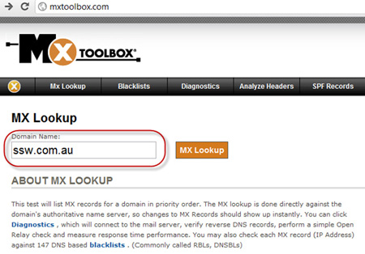
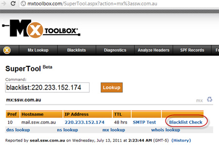
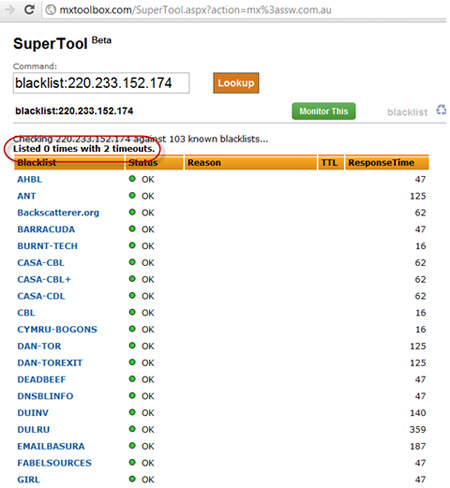
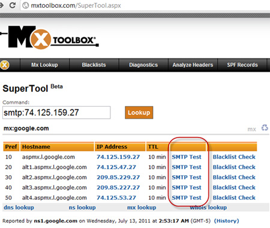

Having people report bounce back emails is frustrating and time consuming. The first thing to try when you get a report is to check that your mail server isn’t on a spam blacklist. An easy way to check this is via [MX Toolbox](http://mxtoolbox.com/).

<!--endintro-->

Next step check that you have primary and secondary (and even better tertiary) MX records setup and working.

If success on both steps the error is most likely on the senders side. Send them the an email to check their mail settings.

::: greybox

Dear xxx,

As per this rule on bounced emails [https://www.ssw.com.au/rules/bounces-do-you-know-what-to-do-with-bounced-email](/bounces-do-you-know-what-to-do-with-bounced-email)

* I have checked Step 1 – it is good
* I have checked Step 2 – it is good

The problem is likely your end

:::
**Figure: What to send the person**
