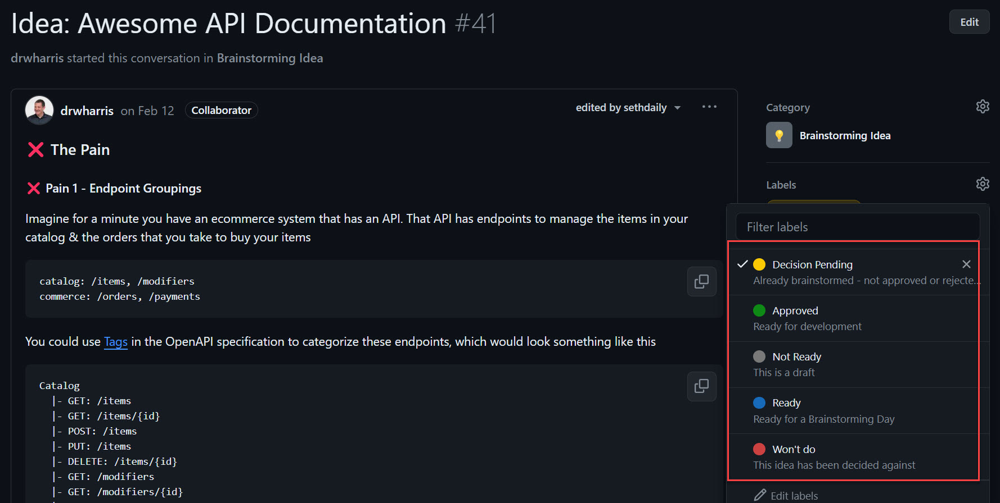

During a Brainstorming day, many great ideas are generated, discussed, and refined. But what happens to these ideas once the day is over? Without a dedicated individual to drive an idea forward, it risks being forgotten or losing momentum. This is where the Idea Champion comes in.

<!--endintro-->

## The Idea Champion's responsibilities

* **Take accountability** for the idea from the end of the brainstorming day until a Scrum Team has been assigned and development has started
* **Discuss** the idea and answer people's questions
* **Communicate** the status of the idea in its [GitHub Discussion](/brainstorming-idea-farming)
* **Push the idea forwards** and get closure (approval/rejection)

### Where it begins

* An Idea Champion should be assigned to each idea for a specific Brainstorming Day. This should be done when [allocating teams](/brainstorming-team-allocation)
* The Idea Champion can change on the day of the Brainstorming, or after, if the team decides there is a better person

### Where it ends

The Idea Champion's role is over when either:

* There is a Scrum Team working on the project
or
* Approval isn't reached and the idea is parked (this is a perfectly acceptable outcome - it can always be revisited in a future [Brainstorming Day](/use-the-brains-of-your-company))

Tip: Labels are a great way to keep the status of an idea up to date! See this rule: [https://www.ssw.com.au/rules/do-you-know-how-to-use-tags-for-github-issues](https://www.ssw.com.au/rules/do-you-know-how-to-use-tags-for-github-issues/)

::: good

:::
