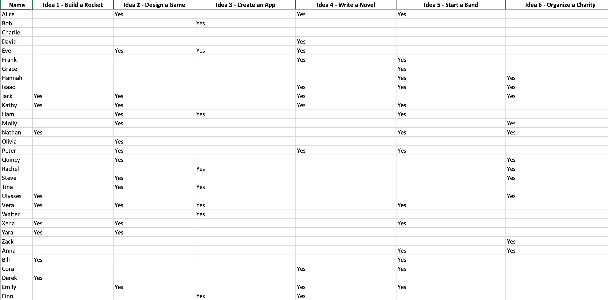
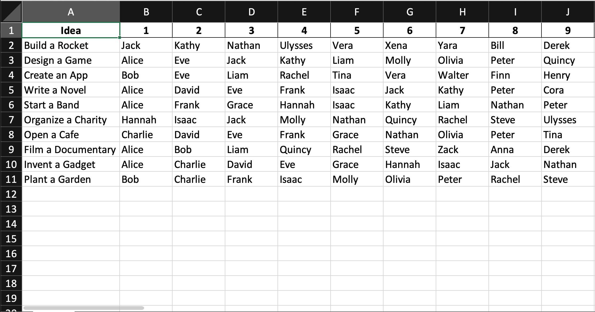

Separating the group into teams on the Brainstorming day can take a long time. It is better to do this before the day. Doing it early also allows you to keep team sizes consistent and share the teams with the group before the day.

<!--endintro-->

## Form - Vote on ideas

Send out a Microsoft Form to the entire company to vote on which ideas they want to work on. It should have the following questions

* Are you attending the Brainstorming day? (2 options - Yes/No)
* For each idea (1 question per idea) - Do you want to work on {{IDEA NAME}}? {{LINK TO DISCUSSION}} (1 option - Yes)
* Indicate that people should pick 3 or more ideas

Having a separate question for each idea is important to get the data in a good format to allocate teams with minimal data transformation.

## Team allocation

Ensure everyone has completed the voting form before allocating teams.

Typically, the form responses exported to Excel will be in a format like this.

This data format makes it hard to assign teams, you can use ChatGPT Advanced Data Analysis to transform data into a better format.

Upload the Excel file to ChatGPT and use this prompt

::: greybox
I need this data in a format to allocate teams, I want each idea as a row and then each person who voted for that idea as a column after it.
:::

1. To assign teams, start by assigning the most capable people to each team as a team lead - it's not required but is helpful if this is the person who came up with the idea
2. After each team has a team lead, assign the remaining people based on their preferences, skillset, and interests

* Aim for team sizes of 3-5 people
* Any larger than this is, it is too hard to manage and get everyone involved.
* Try to encourage inter-office communication by putting people from different offices on the same team.

1. Each team also needs to be assigned an Idea Product Owner person to test the presentation and give feedback.
2. Once everyone is allocated a team, share the result with the group.

### Team setup

In order to make the Brainstorming day as productive as possible, set up the PowerPoints using a template.

1. Create a new Teams team for the Brainstorming day E.g. Sydney Brainstorming 2023
2. For each team, create a folder in the Files tab
3. Use a Brainstorming PowerPoint template to create a PowerPoint for each team
4. [https://www.ssw.com.au/rules/rules-to-better-brainstorming/#presentations](/rules-to-better-brainstorming/#presentations)

Having all the presentations in one location (Teams team) makes it easy to collaborate and ensures they won't be lost. It also means all the presentations can happen on a single device, instead of switching laptops every presentation which can be slow and lead to AV issues.

## Share the teams with the company

Once the teams have been allocated, create a new GitHub Discussion with all the ideas and the teams with a link to the original idea Discussion.
Share the Discussion in an email to the entire company.

Putting the team allocations in a Discussion allows updates if attendees change or if the teams need to be updated.

**Tip:** For extra visibility, also pin it on the repo.
