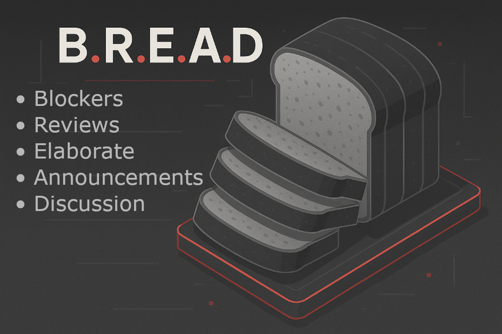

In traditional Daily Scrums, each team member answers the same three questions: "What did you do yesterday?", "What are you doing today?", and "Do you have any blockers?". While this format is fine for small teams, it quickly breaks down in larger ones. The meetings become long and repetitive, people zone out while waiting for their turn, and the most important topics often get rushed at the end.

To solve these pain points, use the **BREAD format** – a structured but flexible approach that scales better and prioritizes unblocking people.

<!--endintro-->

### BREAD Meeting Format

* **B - Blockers**
  * The facilitator addresses blockers one by one with input from the team.
  * The goal is to resolve blockers early so people can move forward.

* **R - Reviews**
  * The facilitator asks who needs code reviews or wants feedback on work.
  * This encourages team collaboration and helps distribute review work.

* **E - Elaborate**
  * Give everyone the opportunity to expand on the bullet points they wrote before the meeting.
  * This enables better understanding or clarification.

* **A - Announcements**
  * Use this phase for communicating upcoming leave, production releases, or meeting changes.

* **D - Discussion**
  * Any other topics or open discussion for the team.

### Why BREAD is better

**Comparison Table: BREAD vs Traditional Stand-ups**

| Feature | Traditional Stand-up | BREAD Format |
| ------------- | ----------- | ----- |
| Team size scalability | Poor for large teams | Excellent for large or distributed teams |
| Meeting flow |   Sequential, person-by-person    |   Topic-based and collaborative |
| Focus on blockers |   Last in the list |   Addressed first |
| Engagement |  Passive (wait for turn) |  Active (raise hand to contribute) |
| Time efficiency |   Can drag out |    Timeboxed and focused |
| Collaboration & input |   Limited |   Encourages full-team input |
| Preparation required |   Minimal (spoken) |   Pre-written updates (shared doc) |

✅ **It scales to larger teams** – since everyone pre-writes their updates in a shared doc, there's no need to listen to people read their notes.  
✅ **Blockers are handled first** – the most valuable part of the scrum gets prioritized.  
✅ **Keeps people engaged** – team members raise their hands only when relevant, so they stay more alert and collaborative.  
✅ **Promotes organic discussion** – people contribute naturally based on topic, not turn order.  

### Meeting Preparation

#### Before the meeting

Each team member writes dot points for their update prior to the Daily Scrum.

::: greybox
**Yesterday:** Finished API integration with Stripe.  
**Today:** Working on unit tests for payment service.  
**Blockers:** None  
**Reviews:** PR #482 needs review  
**Notes:** Planning to deploy to staging today if tests pass.
:::
::: good
Figure: Good example – concise bullet points shared before the meeting allow the team to be informed without time-wasting status updates.
:::

#### During the meeting

* The facilitator progresses through each BREAD phase and asks, "Raise your hand if you have anything for [Blockers/Reviews/Elaborate/Announcements]?"
* Participants raise their hands to indicate they want to contribute.

### When BREAD isn't needed

* Smaller teams where the standard three question Daily Scrum can be more efficient.
* In-person Daily Scrums.

### Tips for running BREAD effectively

* Use a rotating facilitator so everyone gets comfortable leading.
* Set a timebox (e.g. 15–20 min) and adjust based on team size.
* Don't be afraid to cut off topics in D (Discussion) if they need a follow-up meeting – capture them and move on.

By adopting BREAD, your Daily Scrums become more focused, inclusive, and valuable – especially for remote or hybrid teams.
