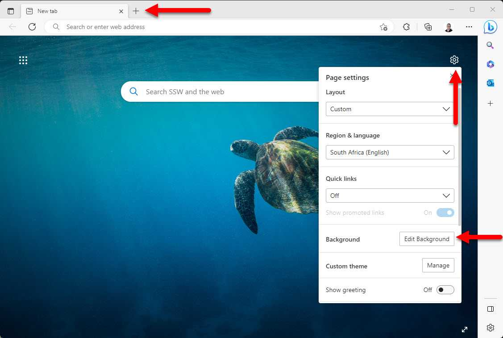
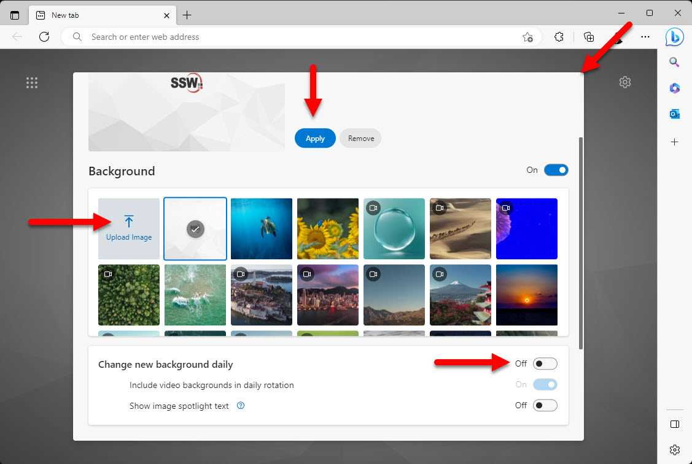

Changing the appearance of your browser's new tabs can greatly enhance your browsing experience and add a touch of personalization. By incorporating branding elements, you can make your browsing sessions more enjoyable and reflective of your unique style.

<!--endintro-->

Setting a different background image for each Edge or Chrome profile is a great way to quickly identify which profile you are using when opening the browser or a new tab.

1. Open your Edge or Chrome browser
2. If you are not in the new tab experience, click the + button to open a new tab
3. Click on settings | Edit Background

   
4. Click on Upload Image, select the image you want to use and click Open
5. Click Apply
6. Uncheck Change new background daily 

   
7. Close the dialog box, note you might have to scroll back up to see the close button

::: info
**Tips:** 

* You may have different themes, like SSW's [dark](/dark-ssw-wallpaper.png) or [light](/light-ssw-wallpaper.jpg) background images
* You can also [change your browser theme color](https://techcommunity.microsoft.com/t5/articles/personalize-microsoft-edge-with-built-in-theme-colors/m-p/2230250) to match your branding. This is especially useful to differentiate multiple profiles in your browser
:::

Now every time you open a new tab or the browser, you will see your custom background image and immediately know which profile you are in without having to glance over to the small profile image.