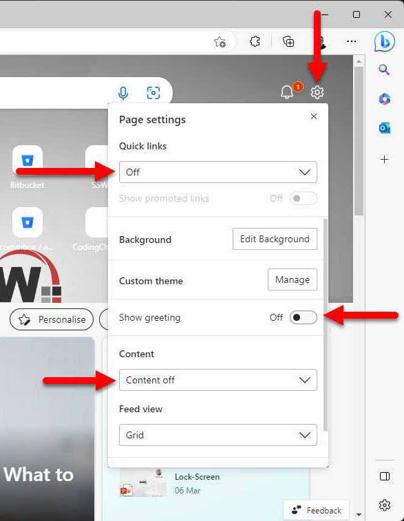
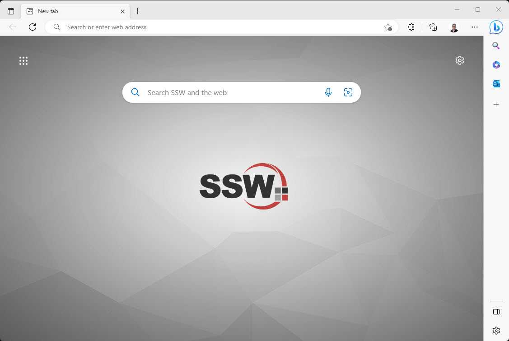
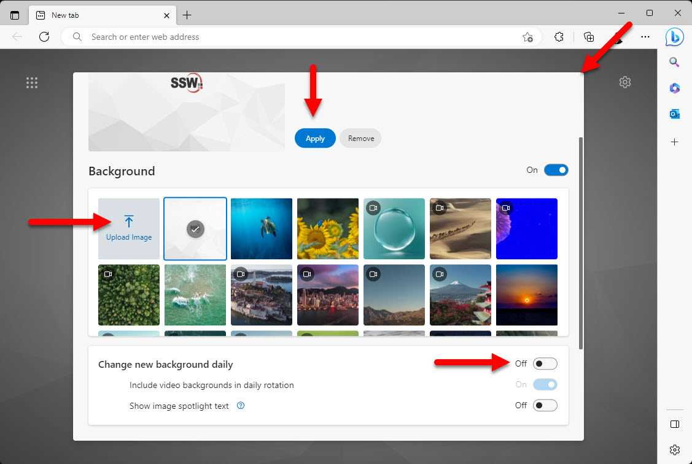

<!--endintro-->

## Remove clutter from your new tab experience

When you open a new tab in your browser and it shows you a bunch of news articles, videos and other clutter, it can be distracting and take you away from your current task. You can remove this noise by turning off all the information in the new tab settings.

1. Open your Edge or Chrome browser
2. If you are not in the new tab experience click the + button to open a new tab
3. Click on settings
4. Change Quick links to Off
5. Toggle off Show greeting
6. Set Content to Content off

Now when you will see a clean new tab experience with no clutter 🤩.

## Setting a custom background image

Setting a different per Edge or Chrome profile background image is a great way to quickly identify which profile you are using when opening the browser or a new tab.

1. Open your Edge or Chrome browser
2. If you are not in the new tab experience click the + button to open a new tab
3. Click on settings | Edit Background

4. Click on Upload Image, select the image you want to use and click Open
5. Click Apply
6. Uncheck Change new background daily 
7. Close the dialog box, note you might have to scroll back up to see the close button

Now every time you open a new tab or the browser you will see your custom background image and immediately know which tab you are in without having to glance over to the small profile image.

::: info
**Tip:** You can also change your browser theme color to match your branding. This is especially useful to differentiate multiple profiles in your browser.
:::