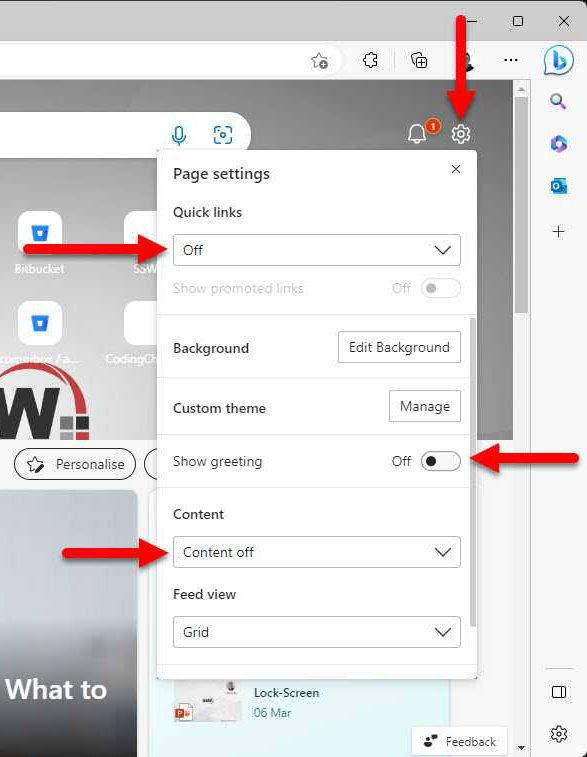

When browsing you often need to open a new tab. By default most browsers will show will a bunch of things to click. That can lead to diversion.

Changing your browser's new tabs settings can enhance your experience and add avoid distractions. By removing all the clutter, you can have a clean and visually appealing environment that aligns with productivity. 

<!--endintro-->

::: bad

:::

Go the extra mile and [add branding to your browser](/browser-add-branding).

::: good

:::

## How to remove clutter from your new tab experience

When you open a new tab in your browser and it shows you a bunch of news articles, videos and other clutter, it can be distracting and take you away from your current task. You can remove this noise by turning off all the information in the new tab settings.

1. Open your Edge or Chrome browser
2. If you are not in the new tab experience, click the + button to open a new tab
3. Click on settings
4. Change Quick links to Off
5. Toggle off Show greeting
6. Set Content to Content off

Now when you open a new tab, you will see a clean experience with no clutter 🤩.
