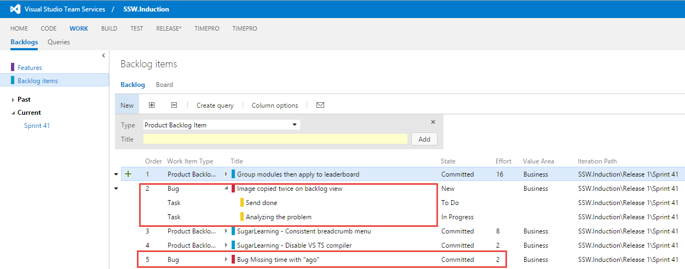

Bugs that are introduced and found because of the current work in the Sprint are included in the Sprint and estimated immediately so the burndown remains accurate. All other bugs found independent of the work on the current sprint are placed on the Product Backlog.

See [Do you know when to create bugs?](/Pages/CreateBugs.aspx) for detailed information on identifying when something is a bug, and when to just fix it.

<!--endintro-->

### Using the Agile process template

In the Agile template, you can't assign Story Points to bugs, meaning that they will negatively impact on sprint velocity.

Bugs found that are independent of the work on the current Sprint are placed on the Product Backlog as a work item “Bug”. The product Owner then ranks the Bugs with priority amongst the User Stories. Bugs cannot have Story Points allocated to them so User Stories need to be created with Bugs as Child Work Items. This is only done when the PO has prioritized the Bug and the Bug is likely to make the next Sprint. At the Planning Meeting, the PO elects which Bugs are to be included and new User Stories are created to group them appropriately with due regard to Severity and Stack Rank. Once the User Stories have been created, The Team estimates the Story Points for each one; the Product confirms User Stack Rank and the Sprint Backlog is planned as normal.

This process:

* Works around the problem of Bugs not having Story Points
* Allows Bugs of the same rank to be sensibly grouped together
* Prevents arbitrary groupings of Bugs which cannot be properly ranked
* Follows the estimate just-in-time philosophy of Scrum
* Prevents small Bugs taking up a whole Story Point

### Using the Scrum process template

In the Visual Studio Scrum template, bugs are just another PBI and you can assign a business priority and an effort estimate in Story Points. Bugs that make the cut for the next sprint can be broken down into tasks and estimated as required.

As bugs from previous sprints are just PBI’s, the PO agrees to a list of bugs that will be fixed in the current Sprint.

The team just fixes any  **new** bugs they introduced in the current sprint.

If the team finds bugs due to functionality accepted in a previous sprint they log it as a PBI and will complete the fix in a future sprint, unless it is a critical bug, in which case they raise it as an impediment to the current sprint to the PO.

Examples:

* **Small bug** – Text on a label is spelled incorrectly
* **Big bug** - There is an error thrown when transitioning from page 1 to page 2 when you hold down the Ctrl key

The Visual Studio team provides good guidance on [managing bugs in VSTS](https://www.visualstudio.com/en-us/docs/work/backlogs/manage-bugs)
 **
**
