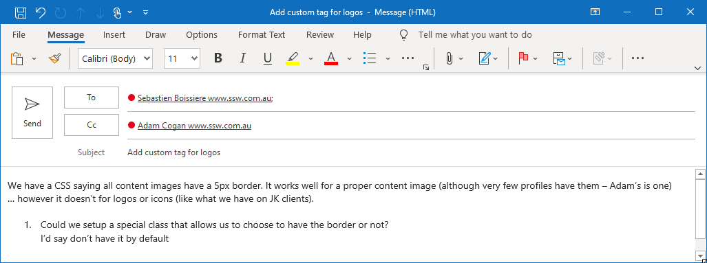
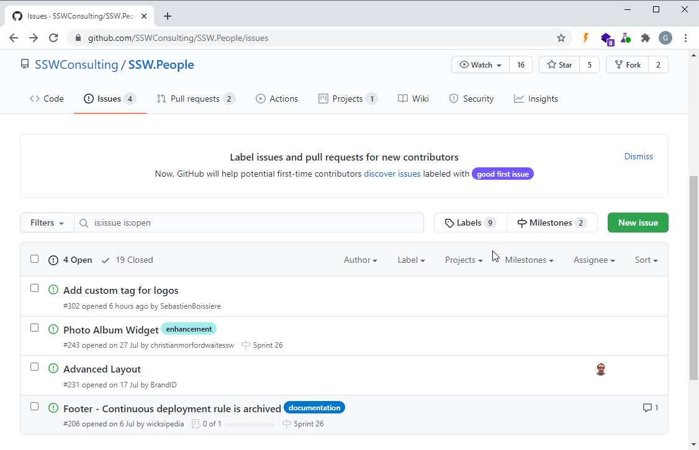
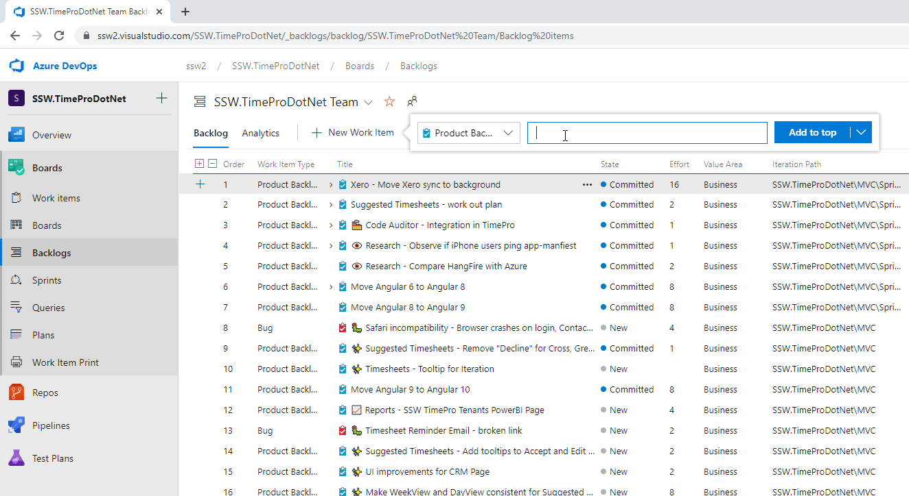

All good Scrum teams have a backlog. The backlog is built by taking a conversation and recording it as one or more **Product Backlog Items** (PBIs) (e.g. Azure DevOps) or **Issues** (e.g. GitHub, JIRA).

You should [create PBIs during or straight after the conversation](https://www.ssw.com.au/rules/report-bugs-and-suggestions), rather than using emails that may never be entered into the backlog.

The Product Owner is responsible for owning the Product Backlog. See the video on ["Do you know how to be a good Product Owner?"](/do-you-know-the-how-to-be-a-good-product-owner)

Although these requirements come from the Product Owner, it is often the developers who will record these PBIs.

<!--endintro-->

#### 1. Emails

::: bad\
\
:::

#### GitHub Issues (Recommended)

::: good\
\
:::

#### 3. Azure DevOps - E.g. https://ssw.visualstudio.com

::: good\
\
:::

**What's next?**

* [Discuss the backlog](/discuss-the-backlog)
* [What to do when it's done?](/dones-do-you-know-how-to-do-a-perfect-done-replying-to-a-bug)