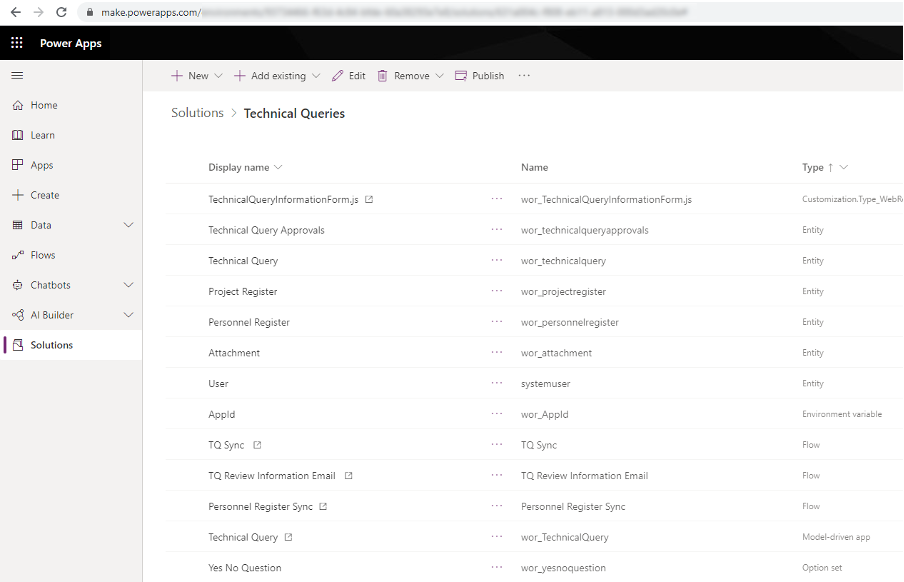

When customizing a Model-Driven App all changes should be in a solution. A solution holds all customization being carried out by the maker, whether it be any custom entities, processes, business rules, or modifications to existing OOTB entities.

<!--endintro-->

Solutions can be used to move these customizations between environments, eg. from development à testing à production.

Solutions can also be used to deploy changes in a managed (testing, production) and unmanaged (development) environment. Managed solutions can be thought of in simple terms and an installer can be installed and uninstalled.

Differences between Managed and Unmanaged solutions:

* When a Managed solution is uninstalled, all artifacts including data are removed
* Unmanaged solutions will install the changes but deleting the solution will leave the changes intact, so think of it as an additive change
* To completely remove all customizations in an Unmanaged solution every customized item needs to be manually deleted

