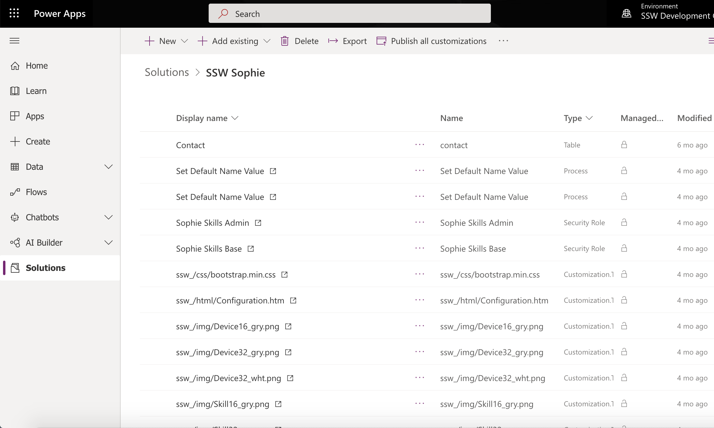

When customizing a Model-Driven App all changes should be in a solution. A solution holds all customization being carried out by the maker, whether it be any custom entities, processes, business rules, or modifications to existing OOTB entities.​ 

 <excerpt class='endintro'></excerpt> 

​Solutions can be used to move these customizations between environments, eg. from development à testing à production.  

Solutions can also be used to deploy changes in a managed (testing, production) and unmanaged (development) environment. Managed solutions can be thought of in simple terms and an installer can be installed and uninstalled.

Differences between Managed and Unmanaged solutions:
<ul><li>When a Managed solution is uninstalled, all artifacts including data are removed​ </li><li>Unmanaged solutions will install the changes but deleting the solution will leave the changes intact, so think of it as an additive change</li><li>To completely remove all customizations in an Unmanaged solution every customized item needs to be manually deleted</li></ul><dl class="image"><dt>
      
   </dt><dd>Figure: Solution show all customizations, make it very easy to move changes between environments </dd></dl><h3>Related Rule </h3><ul><li><a href=/create-a-solution-and-use-the-current-environment-when-creating-flow-for-dynamics>​Do you create​ a Solution and use the "Current Environment" when creating Flow for Dynamics?</a> </li></ul>

