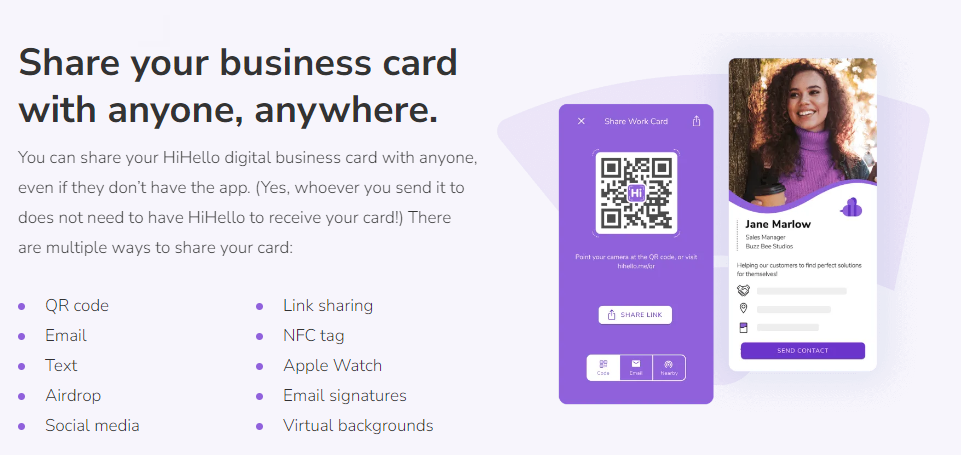

Business cards are essential tools for networking and making a lasting impression on potential clients or business partners. However, traditional paper business cards can present various issues in today's digital age. This rule introduces the advantages of digital business cards over their paper counterparts, emphasizing the benefits of using the HiHello app as a powerful tool for creating and sharing professional and memorable digital business cards.

### The Limitations of Paper Business Cards

Paper business cards, while widely used in the past, come with several drawbacks in the modern business landscape. Here are some common issues associated with paper business cards:

* **Prone to loss or damage:** Paper business cards can easily be misplaced, lost, or damaged, making it challenging to maintain accurate contact information.
* **Environmental impact:** The production and disposal of paper business cards contribute to deforestation and waste, which goes against sustainable business practices.
* **Outdated information:** When contact details change, reprinting paper business cards becomes necessary, resulting in additional costs and time.

### Embracing Digital Business Cards

In contrast to paper business cards, digital business cards offer numerous advantages that address the limitations mentioned above. Here's why digital business cards are a superior choice:

* **Comprehensive information:** Digital business cards provide ample space to include all relevant contact details, ensuring recipients have access to a comprehensive profile.
* **Easy sharing and accessibility:** Digital business cards can be easily shared via email, messaging apps, or even through scanning QR codes, making it effortless for recipients to store and retrieve contact information.
* **Real-time updates:** With digital business cards, updates to contact details can be made in real-time, ensuring recipients always have the most accurate and up-to-date information.
* **Interactive features:** Digital business cards often allow for interactive features like clickable links to websites, social media profiles, or portfolios, enhancing engagement and facilitating further connections.
* **Sustainability:** By opting for digital business cards, you contribute to a more sustainable environment by reducing paper waste and promoting eco-friendly practices.

## The HiHello Mobile App

`youtube: https://www.youtube.com/embed/GsGvctHt0G0`
App Store | search Hihello | Digital Business Cards | HiHello

When it comes to creating and sharing impressive digital business cards, the HiHello app stands out as an excellent tool. Here's why you should consider using the HiHello app:

* **Professional and customizable designs:** The HiHello app offers a wide range of professional and visually appealing templates for your digital business card. You can customize the design to reflect your personal brand and make a memorable impression.
* **Versatile contact details:** HiHello allows you to include various contact details, including phone numbers, email addresses, social media links, website URLs, and more. You can add multiple options for each contact method, ensuring flexibility and convenience for recipients.
* **Easy sharing and scanning:** HiHello simplifies the process of sharing digital business cards by enabling recipients to receive them via email, text message, or by scanning a QR code. This streamlined sharing process saves time and ensures seamless connectivity.
* **Real-time updates and syncing:** The HiHello app enables you to update your contact details on-the-go. Once updated, your digital business card will automatically sync across all devices of your recipients, ensuring they always have the most accurate information.
* **Analytics and insights:** HiHello provides analytics and insights on how your digital business card is performing, such as the number of views and interactions. This data helps you track engagement and assess the effectiveness of your networking efforts.

By leveraging the benefits of digital business cards and utilizing the HiHello app, you can present yourself professionally, enhance networking opportunities, and stay connected with ease.

## Add your Digital Business Card to your Phone's wallet

Digital business cards offer a range of advantages over their paper counterparts, and one of the notable benefits is the ability to add them to phone wallets.

Here are the instructions for adding a digital business card to your phone wallet using the HiHello app:

1. **Download and install the HiHello app:** Visit your app store (iOS or Android) and search for "HiHello." Download and install the app on your smartphone. https://www.hihello.me/
2. **Create your digital business card:** Open the HiHello app and sign up or log in to your account. Follow the prompts to create your digital business card by entering your contact details, choosing a template, and customizing the design to your preference.
3. **Save your digital business card to your phone wallet:** Once your digital business card is created, follow these steps to add it to your phone wallet:

   * **For iPhone users (Apple Wallet):**

     * Tap the "Share" button located at the top right corner of your digital business card within the HiHello app.
     * From the sharing options, select "Add to Wallet."
     * Your digital business card will be added to the Apple Wallet on your iPhone.
   * **For Android users (Google Pay or Samsung Pay):**

     * Tap the "Share" button located at the top right corner of your digital business card within the HiHello app.
     * From the sharing options, select "Save to Gallery" or "Save to Files" to save the digital business card as an image file on your phone.
     * Open the Google Pay or Samsung Pay app (depending on your device).
     * Tap on the "+" or "Add" button to add a new card.
     * Choose the option to add a "Loyalty card" or "Membership card."
     * Follow the prompts to select the saved image of your digital business card from your gallery or files.
4. **Access and share your digital business card:** Once your digital business card is saved in your phone wallet, you can easily access it anytime by opening your wallet app. You can then share it with others by tapping on the card and selecting the sharing option provided by your wallet app.

::: good

:::