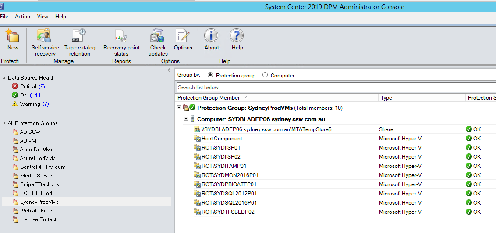

Business continuity is present in any good disaster recovery plan and means that when your services (e.g. websites, hardware, software) fail or suffer an outage, you have redundancy in place to quickly swap and ensure downtime is minimal.        

<!--endintro-->

Having redundancy in place means that you can rest assured that when your services go down, you won't need to touch backups first before getting everything back online - you will failover to a secondary location that will keep your business running while you fix your primary location.

This takes the downtime from days to hours - or even less - due to the services being synced or replicated constantly in a secondary location. This secondary location can even be in the same physical place.

It's always a good idea to have redundancy on-premises and also in an off-premises (e.g. Azure) location, so in cases of any location disasters, you can rest assured your data and services are not affected.

A good example of business continuity tools is Azure Site Recovery, which you can find more about here: https://www.ssw.com.au/rules/azure-site-recovery

Backups are also important in your business continuity and disaster recovery plan, check out our other rules for backups: https://www.ssw.com.au/rules/rules-to-better-backups

