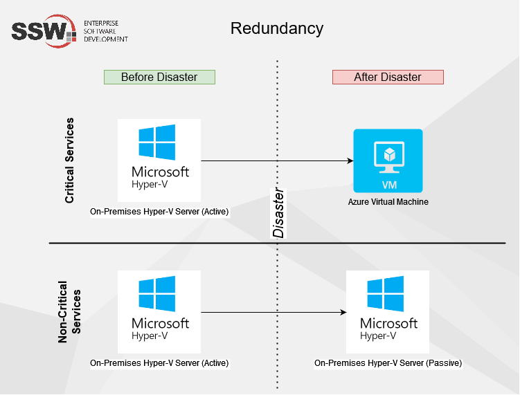

Business continuity is present in any good disaster recovery plan and means that when your services (e.g. websites, hardware, software) fail or suffer an outage, you have measures in place to ensure downtime is minimal.

<!--endintro-->

Before diving further, some terms need to be understood to fully understand the concept of business continuity: **Redundancy**, **High Availability**, **Fault Tolerance** and **Disaster Recovery**. These are concepts used to ensure that a system has as little downtime as possible, by applying different strategies or actions in case of a fault.

## Step 1 - Redundancy

Redundancy is a base concept that is applied to all other concepts e.g. High Availability and Fault Tolerance. Redundancy mainly means having extra hardware or software that can be used as backup (or in tandem) with the primary one e.g. having 2 virtual machines, one on-premises and one in Azure. When one fails, the other one can be used as the backup.

It's always a good idea to have redundancy on-premises and also in an off-premises (e.g. Azure) location, so in cases of any location disasters, you can rest assured your data and services are safe.

Let's imagine a scenario with the company Northwind, this is part of their infrastructure redundancy in their HQ server room:

1. Power Redundancy - Two (or more) UPS on different electrical circuits powering the same servers
2. Backup Redundancy - Two (or more) backup servers on multiple physical locations:

   * **on-premises** - e.g. a Data Protection Manager (DPM) server on Northwind HQ
   * **off-premises** - e.g. a DPM server in Northwind Brisbane branch
   * **cloud** - e.g. in Azure using Azure Site recovery and Azure Backups
3. Hyper-V Redundancy - Two (or more) physical server blades as Hyper-V hosts
4. Storage Redundancy - Two (or more) hard drives for the same data to be stored on
5. Networking Redundancy - Two (or more) firewalls for traffic to go through

There are many ways to automate or apply redundancy, check the below for more information.

## Step 2 - Fault Tolerance (FT) and High Availability (HA)

Fault Tolerance and High Availability work together to ensure maximum uptime, and will be mixed and matched depending on different systems and business needs e.g. FT works wonderfully for storage drives and RAID arrays, whereas HA is better suited for redundant Virtual Machines where you can't easily recover from a corrupted hard drive.

### Fault Tolerance (FT)

This design enables systems to continue operating even if a fail happens - generally in a degraded or reduced state. There is no redirection of workload like in High Availability.

A good example is a RAID 6 array, where if two disks fail, you can keep using it without problems. If a third disk fails, then you lose the whole array - it can tolerate two faults, and is designed in a way that you can fix that fault and rebuild or recover the array to normal again and have no data loss.

Let's imagine the same scenario with the company Northwind, this is part of their FT plan:

1. Storage Fault Tolerance - Local SAN (storage area network) in Northwind HQ, with multiple drives, where some drives can fail without interrupting its usage - giving time for the SysAdmin to swap said drives

### High Availability (HA)

A high available system is one that is designed to be up and available as much as possible. Generally, this means that a secondary system, mirror of the primary, is also up and running at the same time as the primary, and if the primary system goes down, the secondary takes over as soon as it sees a fault in the first one - ensuring the system is online. Swapping to the secondary system might take a bit of time, and that adds to the time the system is down.

Let's imagine the same scenario with the company Northwind, this is part of their HA plan:

1. Power High Availability - Two (or more) UPS on different electrical circuits powering the same servers **with a load balancer that sees one failed and uses the power from the other**
2. Hyper-V Redundancy - Two (or more) physical server blades as Hyper-V hosts **part of the same failover cluster - if one blade goes down, VMs are automatically migrated to another host in the cluster**
3. Networking High Availability - Two (or more) Firewalls working **on an active-passive state - one takes over if the other fails**
4. Software High Availability - Two (or more) webservers behind a load balancer - **they can share the website traffic at the same time, or be in an active-passive state as above**

For HA, one of the key points is having a system that redirects workloads in case of a failure - without that, you might have a redundant system, but not necessarily high available. If you need to manually swap a cable in case of a power failure, that's just redundant but not high available.

::: good

:::

### Step 3 - Disaster Recovery (DR)

A good DR plan consists of HA and FT together and goes beyond only having the above strategies in place - it actually tells you what to do in case of a disaster e.g. natural disasters like eartquakes, cyberattacks or any other cause of downtime.

DR plans generally show different scenarios or systems and what to do in each case e.g. lost a critical system, lost a non-critical system.

As an example, if one of the UPS in your server room stops working, that might not impact the day to day of your business if you have a secondary UPS and a HA circuit or system that automatically fails over between them - you need to replace the failed device, but no downtime is felt throughout the business.
That might not be the case if your UPS fails, you have a secondary UPS, but you need to manually failover to the secondary. Your server room will be all offline until you manually change that cable, and that action should be in the DR plan in the case of a UPS fail.

A good example of business continuity tools is [Azure Site Recovery](/azure-site-recovery).

Backups are also important in your business continuity and disaster recovery plan, check out our other [Rules to Better Backups](/rules-to-better-backups).
