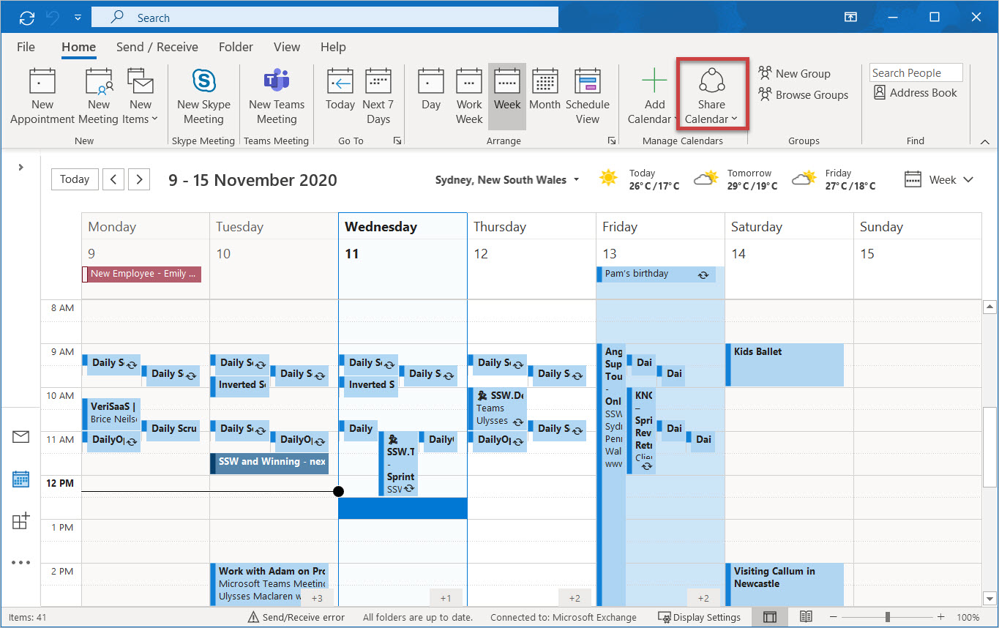
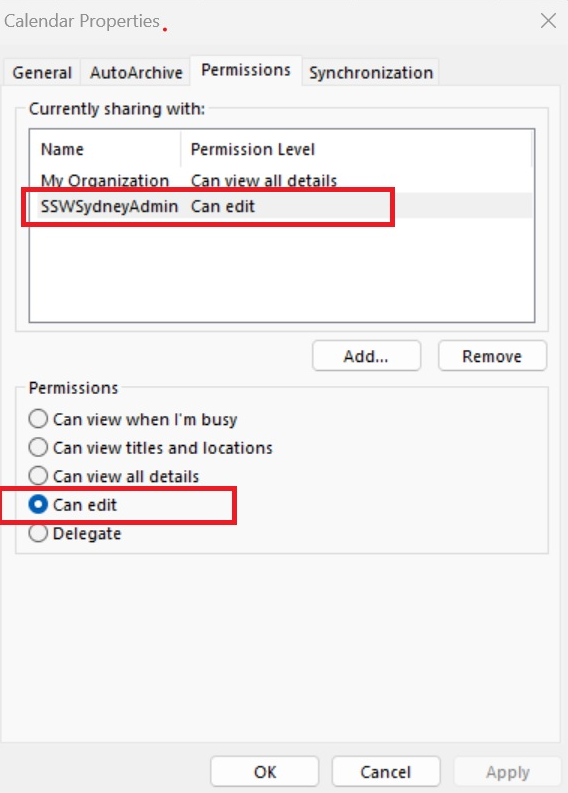
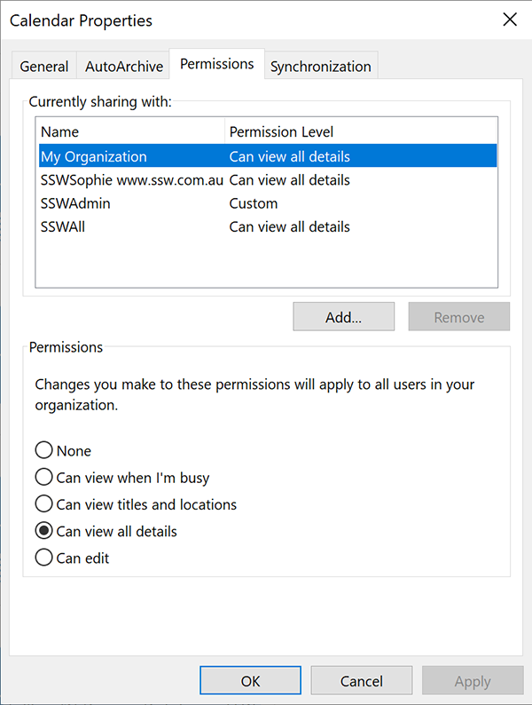
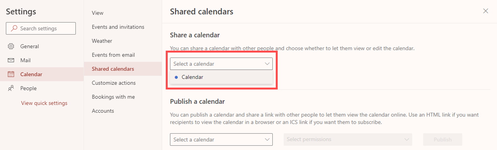
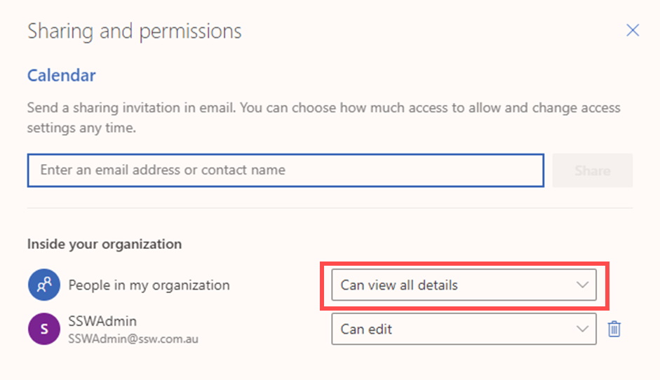
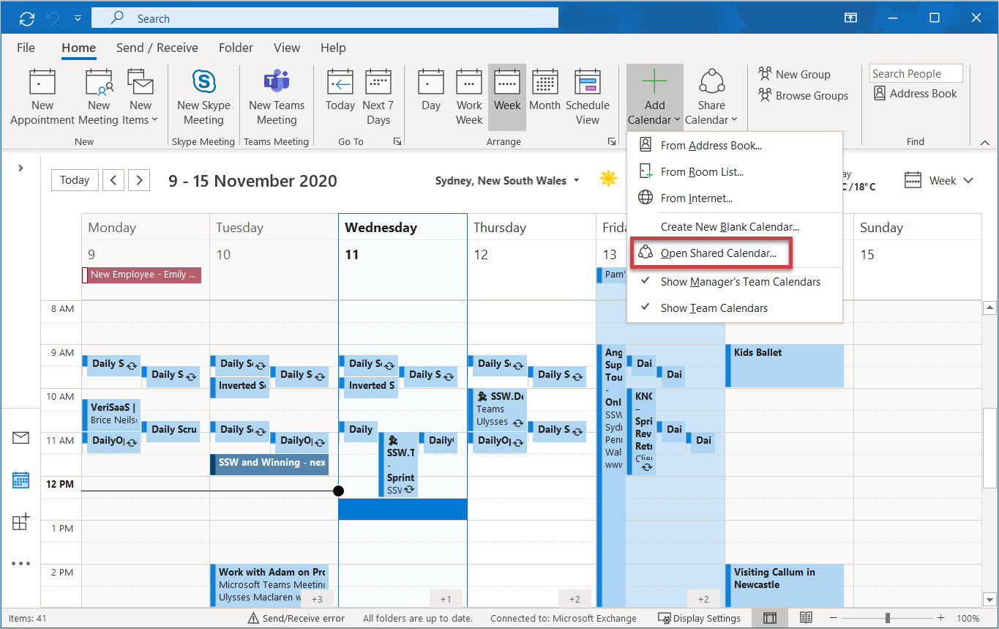
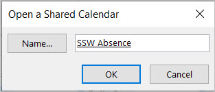

Within a company, there are occasions that you are not able to access your computer to send sick emails, or you get a call from your client on the way to the office that you have to drive to a client site straight away; when such things happen, you need someone else to update your calendar when you call in, so others are aware of your availabilities.

<!--endintro-->

Always make sure that:

* Admin people are able to access your calendar with full permission in order to add/edit/delete appointments for you.
* The whole organization can see your full calendar details.

### Do this to allow Admins to edit your calendar permissions

1. Open Outlook (or Outlook Web) | Click Calendar | Click "Share Calendar" | Click "Add..." | Add the Admin group | Select "Can edit"
   **Note:** Check you are looking in the right address book using the "Address Book" dropdown if you cannot find a user or group.

  

  

Now do this to allow the whole organization to see your full calendar details:

2. Open Outlook (or Outlook Web) | Click Calendar | Click "Share Calendar" | Click "My Organization" | Select "Can view all details"

  

  If you cannot see "My Organization" from Outlook Desktop version, use the web version:

* Open [Outlook Web](https://outlook.office.com/) | Click Calendar | Click “View” | Click “Calendar settings”

* Click “Shared calendars” | in “Share a Calendar”, select the calendar  

  

* In "People in my organization" | Select "Can view all details"  

  

### Opening other people's calendar

Once the permissions are given, opening other people's calendar is as easy as 2 steps:

1. Go to the Calendar tab in outlook and click "open a Shared Calendar"  
    

2. Choose the calendar you want to open in the pop-up form  
   

Then you can have this shared calendar shown in your Outlook.
