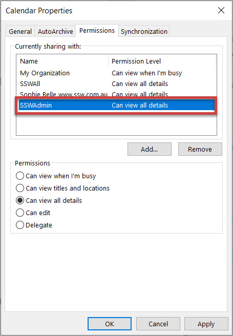

Within a company, there are occasions that you are not able to access your computer to send sick emails, or you get a call from your client on the way to the office that you have to drive to a client site straight away; when such things happen, you need someone else to update your calendar when you call in, so others are aware of your availabilities.

<!--endintro-->

So always make sure the admin people are able to access your calendar with full permission in order to add/edit/delete appointments for you.

  

  

Once the permission is given, open other people's calendar is as easy as 2 steps:

1. Go to the Calendar tab in outlook and click "open a Shared Calendar"  
   

2. Choose the calendar you want to open in the pop-up form  
  

Then you can have this shared calendar shown in your Outlook.
