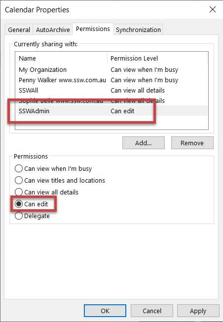

​​​Within a company, there are occasions that ​you are not able to access your computer to send sick emails, or you get a call from your client on the way to the office that you have to drive to a ​client site straight away; when such things happen, you need someone else to update your calendar when you call in, so others are aware of your availabilities.  

 <excerpt class='endintro'></excerpt> 

So always make sure the admin people are able to access your calendar with full permission in order to add/edit/delete appointments for you. ​
<dl class="image"><dt> 
       
        
   </dt><dd>Figure: Click on "Calendar Permissions" </dd></dl><dl class="image"><dt>
      
    </dt><dd>Figure: Give admins full access to your calendar</dd></dl>
Once the permission is given, open other people's calendar is as easy as 2 steps:

1. Go to the Calendar tab in outlook and click "open a Shared Calendar"
<dd class="ssw15-rteElement-FigureNormal">​Figure: Opening a shared calendar​​ </dd>
 
<dl class="ssw15-rteElement-ImageArea">2. Choose the calendar you want to open in the pop-up form: ​</dl>
Figure: Find the calendar you want
 

Then you can have this shared calendar shown in your Outlook.
 

