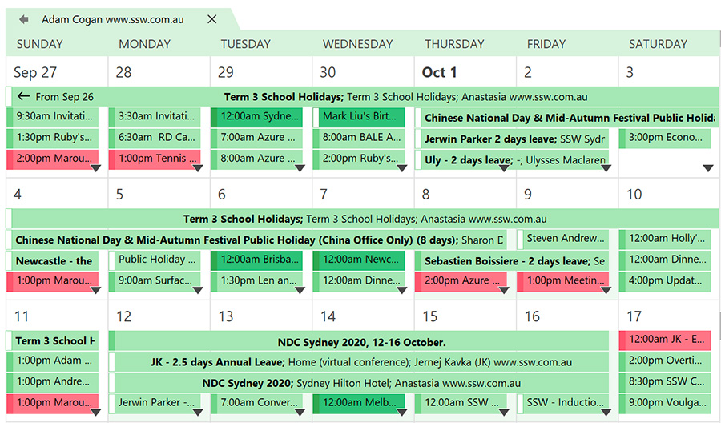

​If someone has <a href="/_layouts/15/FIXUPREDIRECT.ASPX?WebId=3dfc0e07-e23a-4cbb-aac2-e778b71166a2&TermSetId=07da3ddf-0924-4cd2-a6d4-a4809ae20160&TermId=86a7e3f1-964a-47bc-ba84-d28bd42d3df4">shared their calendar permissions</a>​ with you, you will be able to check their calendar directly without needing a conversation. ​​​Imagine someone wants to book some time with you. Offer to look up the calendar and book in time straightaway.​

 <excerpt class='endintro'></excerpt> 
<dl class="bad">
                    <dd>Bad Example - "Try calling him." ​ </dd></dl>
                <dl class="good">
                    <dt> </dt>
                    <dd>
                        Good Example - "Sure, I'll just look up Adam's calendar and see when he's free. Obviously, it's not a good idea to call Adam now as he is on a plane."  </dd></dl>

