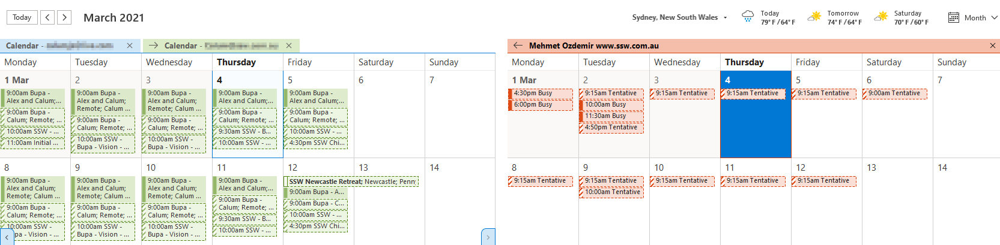
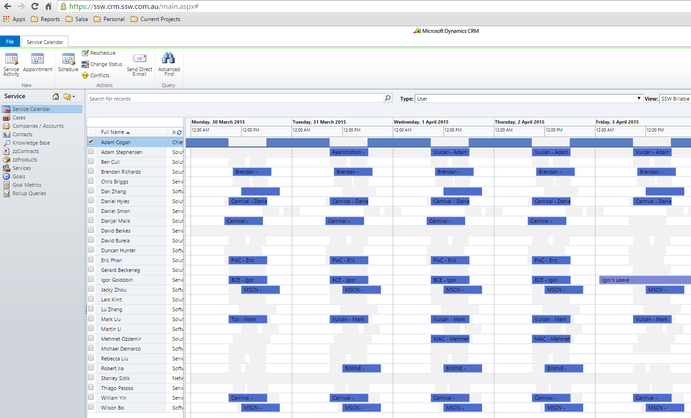
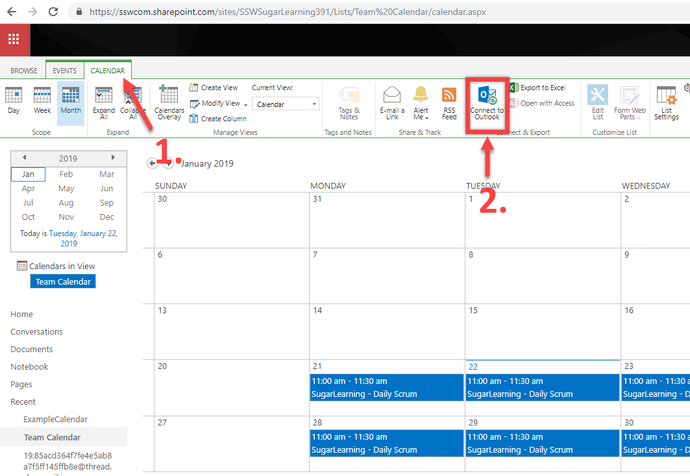

While working in a team, there are three ways of seeing others' or team calendars.

<!--endintro-->

### Option 1: Using Outlook Calendar Permissions - See a person's calendar

You can share your Outlook calendar with another person or a group in Outlook. This option is useful when you want to share your personal calendar with others.

See [Calendar Permissions - Do you share your calendars?](https://www.ssw.com.au/rules/calendar-do-you-allow-full-access-to-calendar-admins)  for step-by-step instructions on how to share your calendar or see another person's shared calendar.

### Option 2: Using the Dynamics 365 CRM Service Calendar - See everyone's calendar

When you want to see what's your colleague is doing, you can use the CRM Service Calendar.

This can keep track of important things like client work and leave. See [Scheduling - Do you know how to book developers for a project?](/scheduling-do-you-know-how-to-book-developers-for-a-project) on how to add a booking to CRM Service Calendar.

**Note:** The CRM Service Calendar is deprecated; Microsoft are now moving to Dynamics Universal Resource Scheduling 

Figure: The CRM Service Calendar shows everyone's booked in client work and leave

**Note:** This will only show appointments that have been tracked in CRM.

### Option 3: Using SharePoint's calendars - See a team's calendar

You can also create a calendar in SharePoint which will be shared with the team on that SharePoint site. By sharing a calendar using SharePoint, new developers who have just joined the team can immediately look at the project's events (e.g. Daily Scrum meeting).

In this scenario, the scrum master of "SSWSugarLearning" wants to share the calendar called "Team Calendar" with his team.

To share a team calendar, you just need to give the calendar URL to the person in your team.
E.g. https://sswcom.sharepoint.com/sites/SSWSugarLearning391/Lists/Team%20Calendar/calendar.aspx

**Tip:** You can also connect the SharePoint calendar to your Outlook. Here's how to do that:

