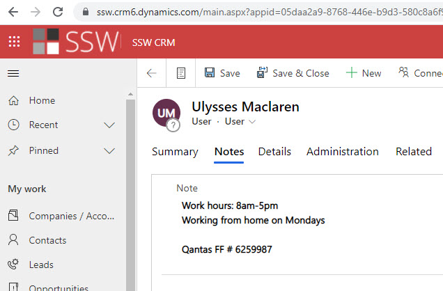

You should always set your working hours in your Outlook calendar so others knows when you are working, this will help us to do resource scheduling.  This is especially important for people who are not working as full time, e.g. part-time, contractors etc.

<!--endintro-->

You can find this setting in File | Options | Calendar Options, it looks like below:

     
**Figure: Outlook Calendar options for working hours settings**

Once you set this up, you will be able to see the grey area in "Scheduling assistant" so you know what's the best time to book that person.

**Figure: Working hours will be shown in Scheduling Assistant**

**Figure: In CRM, Click on the cog in the top right | Personalization Settings**

**Figure: Go to the Activities tab | Enter your default work hours**

This only allows for times that are the same every day. You should also update the Notes field in your CRM User Notes field.

**Figure: Putting your work hours here makes it easy to find for anyone who's interested
