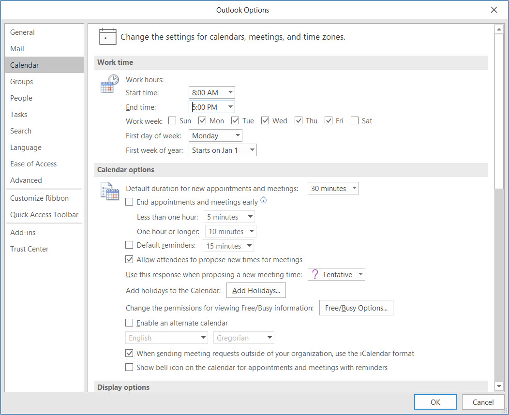
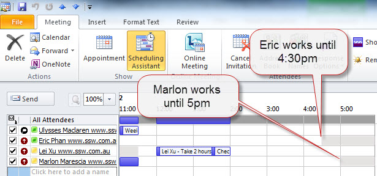
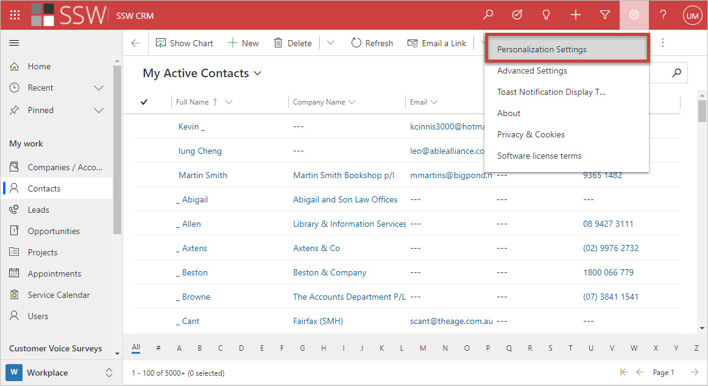
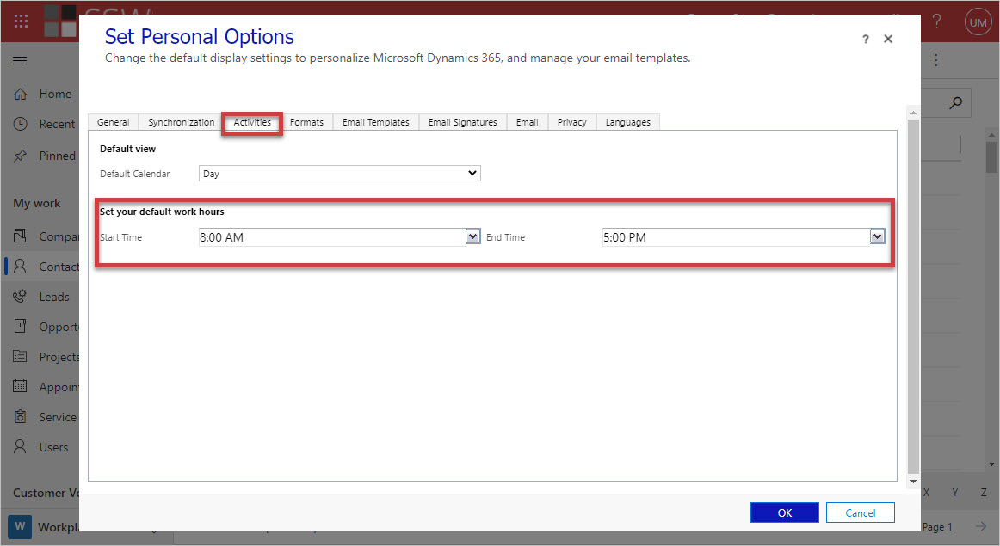
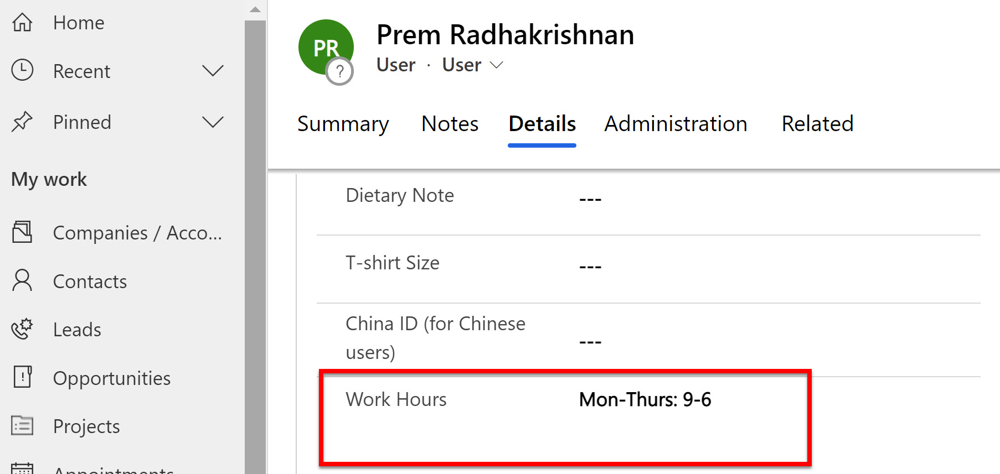

## Set your work hours in Outlook Calendar
You should always set your working hours in your Outlook calendar so others knows when you are working, this will help us to do resource scheduling.  This is especially important for people who are not working as full time, e.g. part-time, contractors etc.

<!--endintro-->

You can find this setting in File | Options | Calendar Options, it looks like below:

Once you set this up, you will be able to see the grey area in "Scheduling assistant" so you know what's the best time to book that person.

## Set your working hours in CRM

This only allows for times that are the same every day. You should also update the work hours field in your CRM Details Tab.

::: good

:::