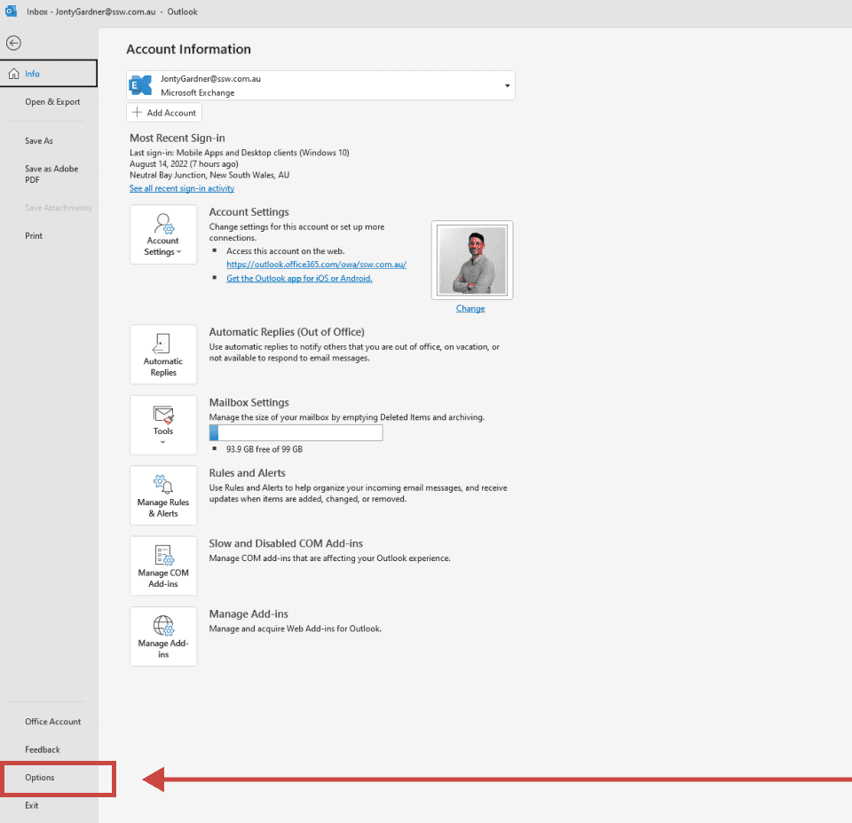
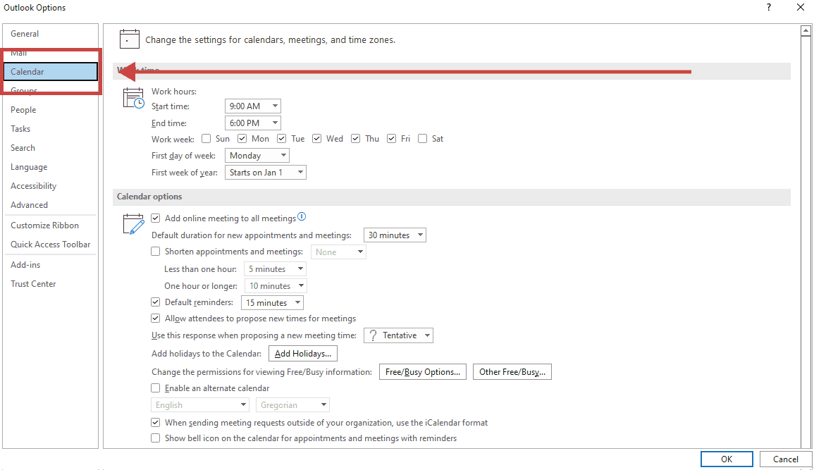
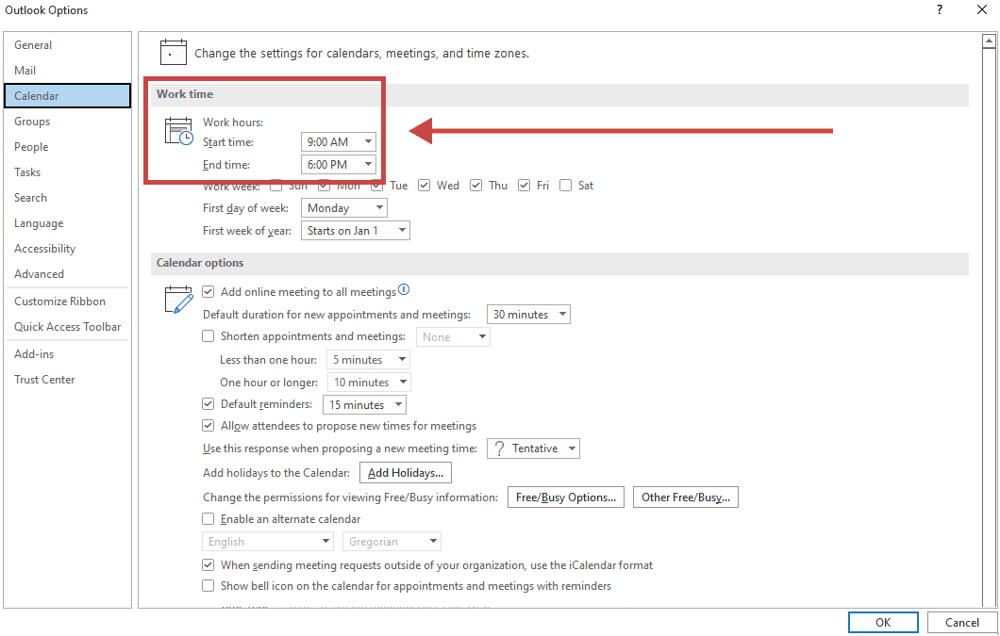
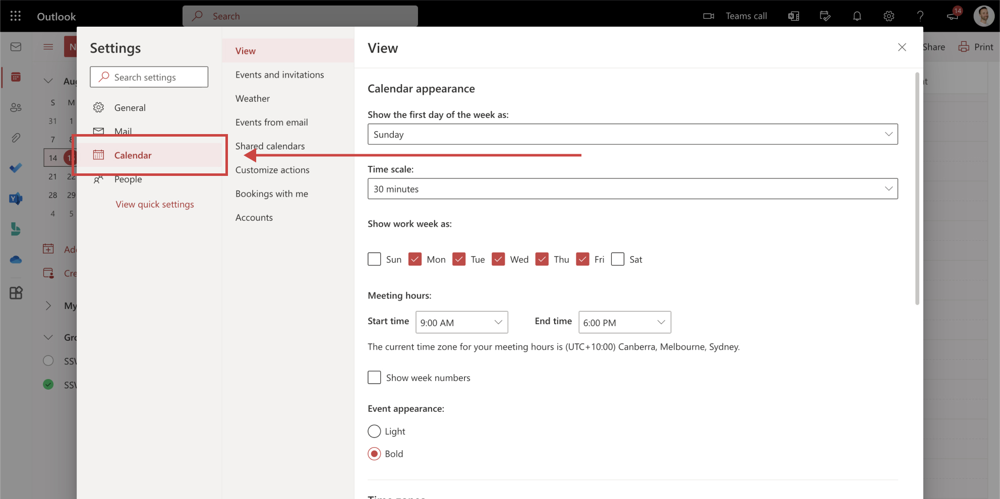

Setting up an Outlook calendar can be highly beneficial not just for you, but also for others who need to see your availability. By sharing your calendar with your colleagues, they can easily see when you are free or busy and can schedule meetings or appointments with you. 

This can avoid scheduling conflicts, especially when different people work different hours. For example, if the company has standard hours (9am to 6pm), when someone is working different hours (say 8am to 5pm) it is desirable to have this visible in Outlook for others making an appointment.

<!--endintro-->

## Set your work hours in Outlook Calendar

You should always set your working hours in your Outlook calendar so others knows when you are working, this will help us to:

✅ Let others know when you are working   
✅ Allow for better company resource scheduling   
✅ Communicate better with part time employees and contractors   

### On Windows OS

1. Go to your [Outlook calendar](https://outlook.office.com/calendar)

2. Click on **File | Options**
   

3. Click on **Calendar**
   

4. Set your work hours
   

### On macOS

1. Go to your [Outlook calendar](https://outlook.office.com/calendar/)
2. Click on **Settings**
   

3. Click on **Calendar**
   

4. Set your work hours
   

Once you set this up, you will be able to see the grey area in "Scheduling assistant" so you know what's the best time to book that person.

### Set your work hours in CRM

This only allows for times that are the same every day. You should also update the work hours field in your CRM Details Tab.

::: good

:::
