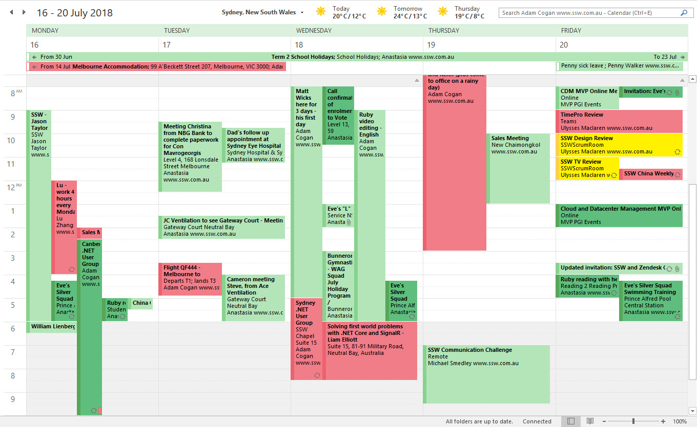

​​​​The following steps will help you to setup your calendar to allow us track your current availabilities and improve our team collaboration. 

 <excerpt class='endintro'></excerpt> 

   <strong>Step 1:</strong> Set your work hours in Outlook Read rule: 
   <a href=/calendar-do-you-set-your-work-hours-in-your-calendars>Do you set your work hours in your Calendars?</a> 

 
   <strong>Step 2:</strong> Share your outlook calendar with everyone Read rule:  
   <a href=/calendar-do-you-know-the-ways-to-share-and-see-others-calendars>Do you know the ways to see others' calendars? </a>

 
   <strong>Step 3:</strong> Allow calendar admins to have full access to your calendar Read rule: 
   <a href=/calendar-do-you-allow-full-access-to-calendar-admins>Do you share your Calendar? </a> 

 
   <strong>Step 4:</strong> Send your leave appointments to a centralized leave calendar Read rule: 
   <a href=/calendar-do-you-use-a-centralised-leave-calendar>Do you use a centralized leave c​alendar?</a> 
<dl class="image"><dt></dt><dd>Figure:  Keep your calendar up-to-date and set to share, so people can always find where you are​ </dd></dl>

