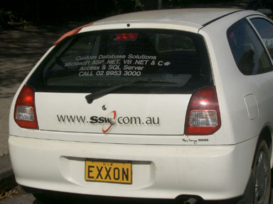
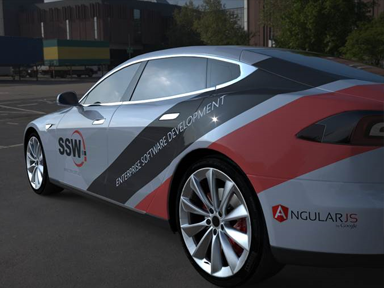

It's a good idea to brand your company's cars when they're on the road. These cars are essentially moving billboards for the company.

<!--endintro-->

To get more cars, you can reward employees to brand their personal cars. Make sure the cars look nice!

::: bad  
  
:::

::: good
 
:::
