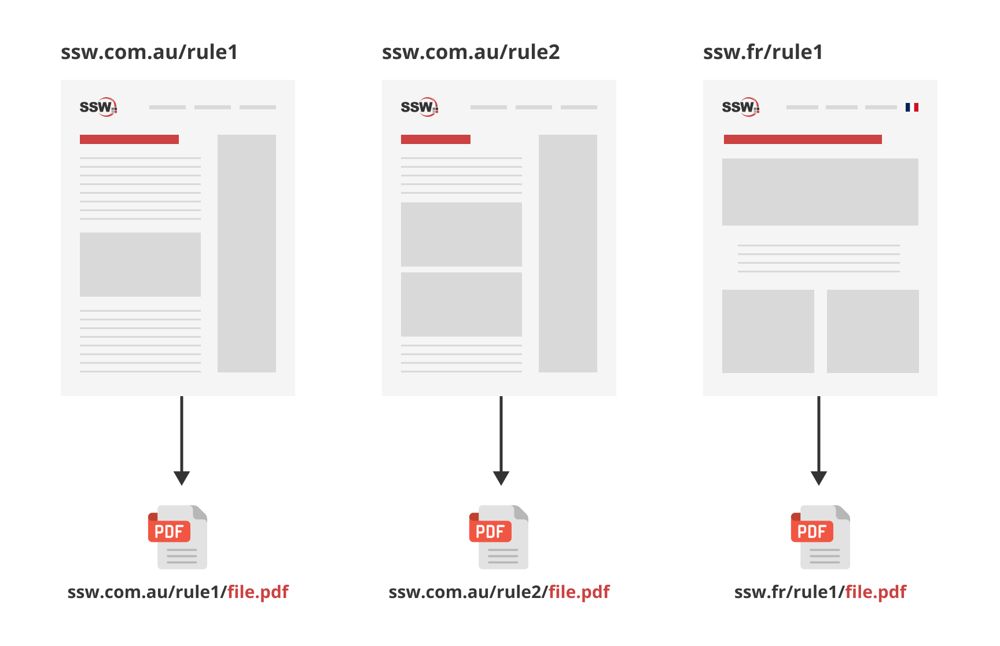
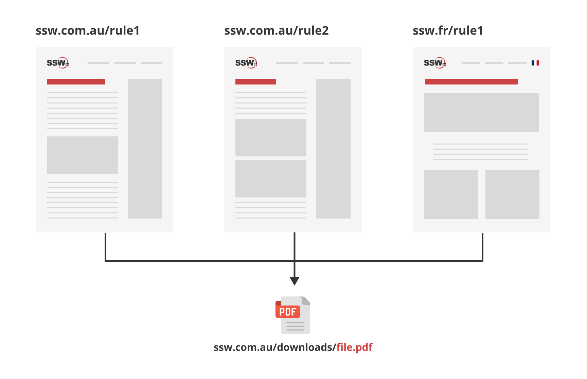

Efficient management of downloadable content, like PDFs and documents, is a critical component of website maintenance. Simplify the process of making files public on your website by following these guidelines.

<!--endintro-->

## Centralized file storage

* **Primary directory** - Use 'public/downloads' as the central directory for all downloadable files to simplify organization, updating, and tracking of content
* **Subdirectory use** (optional) - If needed, employ subdirectories for additional organization (based on the volume and diversity of the files)
* **Uniform linking** - Direct all download links to this central location to eliminate duplication and streamline site maintenance

## Efficient file naming

* **Descriptive naming** - Use clear, descriptive file names with SEO-friendly keywords for easy identification and discoverability
* **Version control** - Keep version information within documents, not in file names, to maintain consistent URLs

## Optimizing file accessibility

* **File compression** - Compress larger files to improve download speed and site performance
* **Accessibility compliance** - Ensure that all files comply with [ADA](https://www.ada.gov/resources/web-guidance/) and [WCAG](https://www.w3.org/TR/WCAG21/) guidelines

::: bad

:::

::: good

:::

## Step-by-step guide

1. **Optimize files** - Compress file sizes without compromising quality and use clear, descriptive filenames
2. **Upload files** - Place files in the central directory or relevant subdirectories
3. **Streamline URLs** - Use and reference a single, stable URL for each file to avoid creating multiple links for the same content
4. **Ensure accessibility** - Ensure that the files are accessible and functional across different browsers and devices

Improve your website's management of downloadable content by centralizing file storage, utilizing clear naming conventions, and ensuring accessibility.
