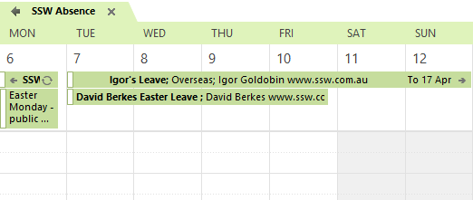

People take leave all the time, and it can be frustrating to find out that someone is not in the office after you've already sent an email to book them for a meeting.  You should have a centralized system to check for everyone's availability.

<!--endintro-->

The easiest way to do this is to use a shared calendar that is just used for leave. At SSW, we have the **SSWAbsence** calendar for this. This requires people to send their leave requests as an appointment to SSWAbsence.

Since this is just a calendar, you should also have these leave requests automatically to your admin managers (e.g SSWAdmin), so they are always notified of what's going on, although normally these managers will decline the notification rather than add it to their own calendar by accepting it.

::: good

:::
