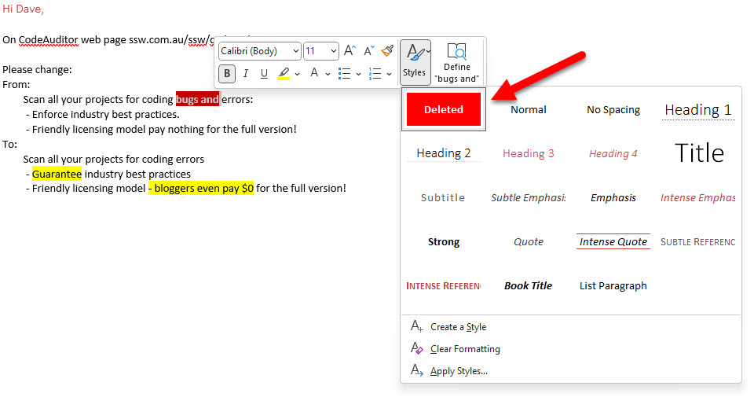

When asking for changes on a web page, Word document, PowerPoint slide, or code, always use "Change from X to Y".

This process consists of including the original version of the content ("X") among with the changes you require ("Y"). It means you easily see the page or file content as it was prior to your changes. This history is convenient for **future reference** and also **makes it very clear** to the person doing the changes exactly what the new file is meant to look like. 

<!--endintro-->

`youtube: https://www.youtube.com/embed/zP5xdELqlBY`
**Video: Best way to ask for content changes | Ulysses Maclaren | SSW Rules (5 min)**

### Using email for small edits

Make the changes even easier to see and understand by highlighting:

* In <mark>yellow</mark> - Content you want to add/update (only do this on the "To" section)
* In red (with white and bold text) Content you want to delete, whether it be specific text or an entire sentence (only do this on the "From" section)
  **Note:** Only indicate in red the content that will **not** be replaced/updated with something correlated.

**Note:** All text we do not write ourselves [should be indented](/do-you-use-indentation-for-readability), so this includes paragraphs we are copying and pasting.

::: email-template
|          |     |
| -------- | --- |
| To:      | Dave |
| Subject: | Update CodeAuditor features list |
::: email-content  

### Hi Dave,

1. For the CodeAuditor web page, please make the list read:

Scan all your projects for coding errors:

\- Guarantee Industry best practices

\- Friendly licensing model, bloggers even pay $0 for the full version!

:::
:::
::: bad
Figure: Bad example - The original version of content has not been included in the email... it is hard to tell what needs to be changed
:::

::: email-template
|          |     |
| -------- | --- |
| To:      | Dave |
| Subject: | Update CodeAuditor features list |
::: email-content  

### Hi Dave,

On CodeAuditor web page ssw.com.au/ssw/codeauditor

1. Please change:

From:

&nbsp;&nbsp;&nbsp;&nbsp;&nbsp;&nbsp;&nbsp;&nbsp;Scan all your projects for coding bugs and errors:

&nbsp;&nbsp;&nbsp;&nbsp;&nbsp;&nbsp;&nbsp;&nbsp; - Enforce industry best practices.

&nbsp;&nbsp;&nbsp;&nbsp;&nbsp;&nbsp;&nbsp;&nbsp; - Friendly licensing model pay nothing for the full version!

To:

&nbsp;&nbsp;&nbsp;&nbsp;&nbsp;&nbsp;&nbsp;&nbsp;Scan all your projects for coding errors

&nbsp;&nbsp;&nbsp;&nbsp;&nbsp;&nbsp;&nbsp;&nbsp; - <mark>Guarantee</mark> industry best practices

&nbsp;&nbsp;&nbsp;&nbsp;&nbsp;&nbsp;&nbsp;&nbsp; - Friendly licensing model<mark> - bloggers even pay $0</mark> for the full version!

:::
:::
::: good
Figure: Good example - 'From' and 'To' changes are highlighted... it is clear what needs to be changed
:::

**Video:** [Top 10+ Rules to Better Email Communication with Ulysses Maclaren](https://www.youtube.com/watch?v=LAqRokqq4jI)

- - -

#### Tip #1: Microsoft Teams - Use the same X to Y style

**Note:** Microsoft Teams doesn't currently allow you to set the font color to white

#### Tip #2: Microsoft Outlook - Add a style to make delete highlightings easy

**Tip:** You can right click to bring up the format text toolbar 

**Tip:** By default, saved styles are ordered alphabetically. Add numbering in their name to customize their order of appearance

::: bad

:::

::: good

:::

### Alternative - What if there are too many changes?

Sometimes you have a lot of content and too many changes, making the process "from X to Y" too arduous. In this case is recommended to use [Word 'Track Changes'](https://support.microsoft.com/en-gb/office/track-changes-in-word-197ba630-0f5f-4a8e-9a77-3712475e806a?ui=en-us&rs=en-gb&ad=gb) functionality.

### Alternative - What if you have a website managed by GitHub?

Some websites use GitHub to manage their files (e.g. [SSW Rules](https://github.com/SSWConsulting/SSW.Rules.Content)). GitHub makes reviewing changes easy through "Pull Requests".

::: info
**Note:** When highlighting text in HTML/Markdown you [should avoid `` tags](/do-you-know-font-tags-are-no-longer-used). Use `` instead.
:::
