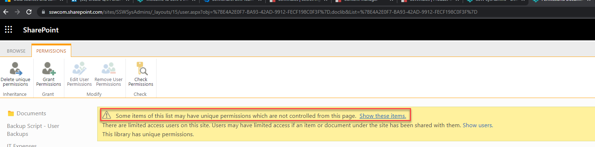

If you are checking your sites permissions regularly you will probably notice a lot of unique permissions being applied.



If you regularly see this then your staff may be accidentally doing this.  The default "Copy Link" in SharePoint is usually set to People from your organization can view this document.  This creates a sharing link each time it is used, giving people access to the file even if they didn't already.  Instead they should be created with the "People with existing access tag"

<!--endintro-->

To fix this issue you need to change the default sharing method.  There are 2 ways to do this - manually via the GUI or automatically via PowerShell using PNP.

## Method 1 - Manually via SharePoint Admin

1. In the SharePoint Admin site select the SharePoint site and click Sharing

   
2. Untick same as organization-level setting | Select People with existing access | Click Save

   

## Method 2 - Automatically via PowerShell

1. Run the following script to change this default for all sites in your SharePoint Hub-Site - This could be extended to include all sites in your tenant if required.

```
#Variables
$AdminCenterURL = "https://sswcom-northwind.sharepoint.com"
$HubSiteURL = "https://sswcom.northwind.com"

 
#Connect to Pnp Online
Connect-PnPOnline -Url $AdminCenterURL -Interactive
 
#Get the children of the main HubSite
$hub = Get-PnPHubSiteChild -Identity $HubSiteURL


foreach ($url in $hub)
{
    #Remove the "Same as organization-level" setting. Can be set to anything Internal, None or Direct.  
    Set-PnPTenantSite -Url $url -DefaultSharingLinkType Internal

    #Set the Default Link type to be Existing Access
    Set-PnPTenantSite -Url $url -DefaultLinkToExistingAccess $true
    
}
```